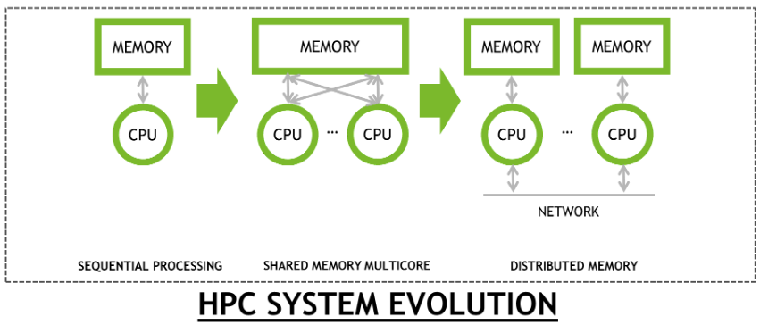
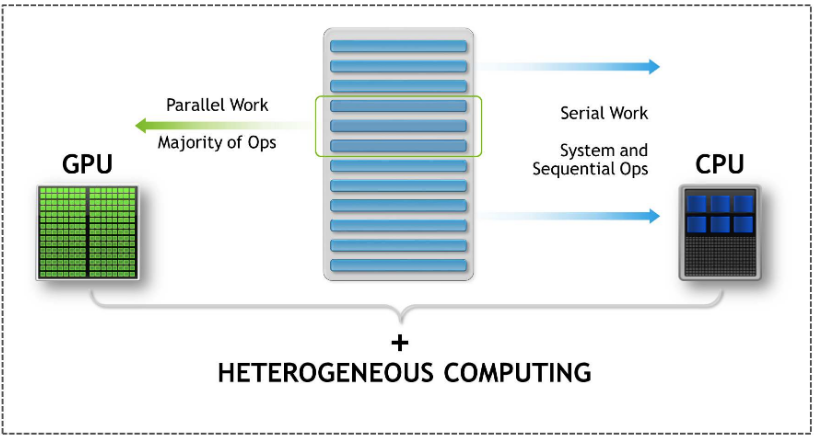
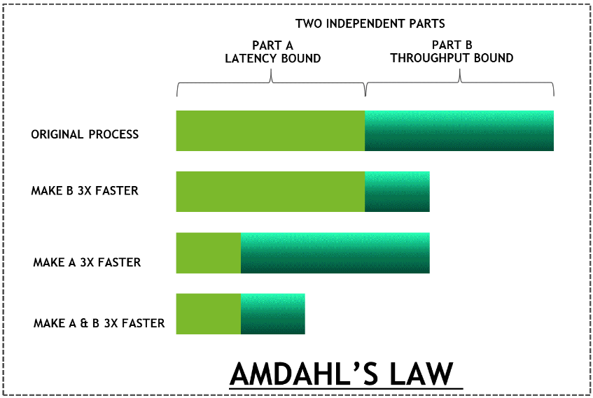
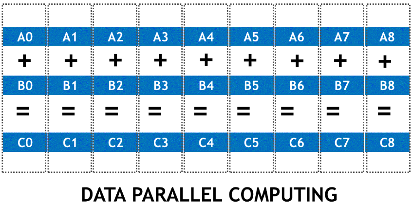
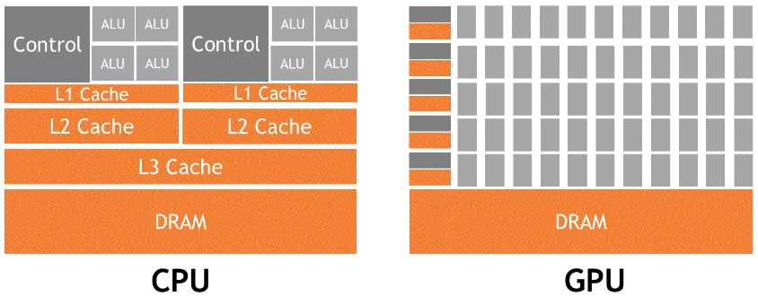
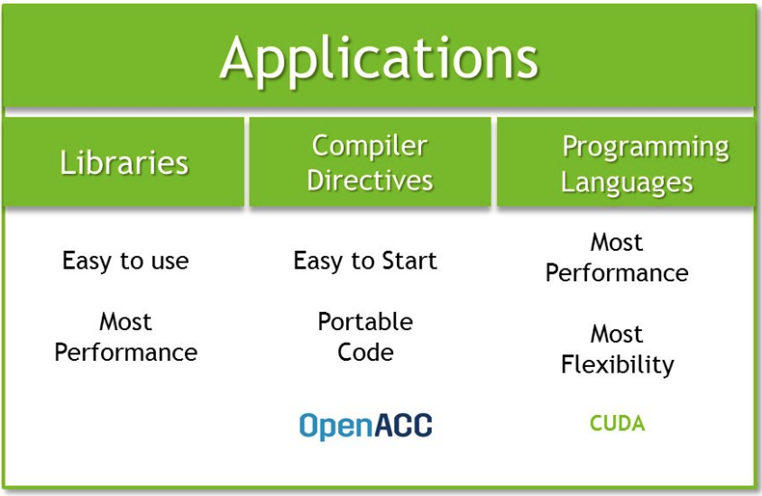

# 1.1 The history of high-performance computing
HPC は科学的な発見のために，常にその限界を押し上げてきた．
プロセッサのアーキテクチャとデザインの根本的な転換によって，「FLOP の壁」をいくつも乗り越えてきた．
それは，**Mega-Floating Point Operations (MFLOPs)** から始まり，今では1秒で PetaFLOP 級の計算も可能になった．

※ Floating-Point Operations (FLOPs) per second : 
理論上，1秒間に浮動小数点演算が何回できるかを示す尺度 ([Wikipedia](https://ja.wikipedia.org/wiki/FLOPS#:~:text=FLOPS%EF%BC%88%E3%83%95%E3%83%AD%E3%83%83%E3%83%97%E3%82%B9%E3%80%81Floating%2Dpoint,%E6%80%A7%E8%83%BD%E6%8C%87%E6%A8%99%E3%81%AE%E4%B8%80%E3%81%A4%E3%80%82))  
※ Instruction-Level Parallelism (ILP) : 
プログラムの中で並行して実行できる処理がいくつあるかを示す尺度 ([Wikipedia](https://ja.wikipedia.org/wiki/%E5%91%BD%E4%BB%A4%E3%83%AC%E3%83%99%E3%83%AB%E3%81%AE%E4%B8%A6%E5%88%97%E6%80%A7))

新しいプロセッサ設計の重要な変化と科学者のコミュニティへの影響を引き起こした，
技術の変遷という観点から HPC の歴史を見たとき，次のように大きく3つの時代に分けることができるだろう．

- Epoch 1  
  スーパーコンピュータの歴史は CRAY-1 まで遡る．  
  基本的なシングル・ベクタ CPU アーキテクチャで，最大 160MFLOPs の計算能力を持つ．
- Epoch 2  
  CRAY-2 はシングルコアからマルチコアを採用することで，「MegaFLOP の壁」を破った．  
  4コアのベクタ CPU で，最大で 2GFLOPs の計算力があった．
- Epoch 3  
  「GigaFLOP」の壁を越えたのは，根本的な変革で，より高い性能を得るために複数のコンピュータ・ノードと
  ネットワークによる相互接続が必要となった．
  CRAY T3D は 1TFLOPs を達成した最初のコンピュータの一つである．
  3D Torus ネットワークは 300MB/s の帯域幅があった．
  これは，標準的なマイクロプロセッサの周辺に実装された "rich shell" としては最初で重要なものである．

この後，ほぼ20年の間，根本的な変革はなかった．
技術革新は，次の3つのアーキテクチャの変革によって引き起こされる．

- 命令セットが 8-bit から，16-bit，32bit，そして 64-bit へと移行していったこと
- ILP が向上したこと
- コア数が増えたこと

これは，クロックの上昇に支えられ，今では4GHzになった．
こうした発展は，半導体産業を動かしてきた基本的な法則を根拠に実現されてきた．
ムーアの予測は数十年に渡って継続され，それは今でも続いている．
ムーアの法則は歴史的潮流の観察と投影の結果なのである．

### デナード・スケーリング (Dennard scaling)
デナード・スケーリングはムーアの法則を存続せしめるスケーリング則である．
デナードはトランジスタサイズとエネルギー密度の観察を行い，次のような式を見出した．

$$
P = QfCV^2 + VI_{leakage}
$$

$Q$ は トランジスタ数，$f$ は動作周波数，$C$ は静電容量，$V$ は動作電圧，$I_{leakage}$ は漏れ電流を表す．

デナード・スケーリングとムーアの法則は互いに関係しあっており，トランジスタサイズを小さくすることによって，
費用対効果の面でチップあたりのトランジスタ数を増やすことができるのである．

デナード・スケーリング則によれば，プロセッサの数を増やしても，チップあたりの合計の消費電力は一定となる．
2年で $1/S$ にサイズを縮小しつつ，トランジスタ数を2倍にし，周波数を40%高めることができる．
この法則は，漏れ電流が指数関数的に増加するために，65nm 以下のプロセスルールでは成り立たなくなってしまった．
漏れ電流の影響を抑えるため，プロセスに新たな技術革新がもたらされた．
しかし，電圧をスケーリングを維持するには不十分であった．
今でもプロセッサの動作電圧は1Vのままである．
もはや，消費電力を一定に保つのは不可能である．
これは，"Powerwall" としてもよく知られている．

デナード・スケーリングは1977年から1997年まで維持されたが，その後は達成できなくなった．
そのため，2007年から2017年の間に 45nm から 16nm にシュリンクは進んだが，チップサイズあたりのエネルギー密度は
3倍になってしまった．

同時に，パイプラインのステージ数も5から，最近のアーキテクチャでは15以上に増加している．
命令実行パイプラインを充足するために，投機的実行のような先端技術が使われている．
投機的実行を行うには，分岐予測やメモリ番地の予測など，プログラムの動作予測が必要となる．
予測が当たれば先に進めるが，そうでなければ結果を破棄して実行をやり直す．
パイプラインのステージが深くなると，古いソフトウェアの記述方法では，
使われないトランジスタが生じ，クロックサイクルが無駄になってしまう．
すると，アプリケーションの性能の観点で改善が見込めなくなる．

その後 GPU が登場したが，主にグラフィック処理に使われていた．
Mark Harris という研究者が，はじめて GPU をグラフィック以外のタスクに用いた．
このことから，新しい GPU の使いみちを **General Purpose Computation using GPU (GPGPU)** と呼んだ．
データ並列化が可能な特定のタスクにおいて，GPU の使用が有効であることが示された．
当然といえば当然だが，HPC で扱う多くのアプリケーションにおける，ほとんどのタスクが，
もともとデータ並列化が可能である．
ほとんどの場合，行列同士の掛け算で，**Basic Linear Algebra Specification (BLAS)** の繰り返しであり，
広く使われている．

唯一，GPU を適用したり使用したりするときに，ユーザにとって問題になるのは，
GPU を使ったグラフィック処理のパイプラインを理解する必要があることだ．
あらゆる計算用途に提供されているインターフェイスだけが，シェダー実行を中心とした GPU 上で動作している．
また，HPC コミュニティで活動する開発者に知られている，より汎用的なインターフェイスを提供する必要がある．
これは，2007年に CUDA が登場したことで解決した．

GPU は従来のヘテロジニアス・アーキテクチャと同じく，ムーアの法則やデナード・スケーリングなどの法則によって
縛られているが，プロセッサの設計のアプローチは大きく異なり，トランジスタをこれまでとは違った使い方をすることで，
より高い計算能力を実現している．

下の図は，逐次処理から分散メモリ処理に至るコンピュータ・アーキテクチャの発展と，
プログラミング・モデルに与えた影響を示している．

既存のサーバに GPU を追加することで，2種類のプロセッサ(CPU と GPU)上でアプリケーションが実行され，
これによって，ヘテロジニアス・コンピューティングの概念が実現される．
次節では，このことについて詳しく見ていく．

## 1.1.1 Heterogeneous computing
GPU についての勘違いでよくあるのは，それが CPU の代替手段であるということである．
GPU は元々，並列化できるコードの一部を高速化するのに使われる．
"Accelerator" は GPU によく使われう用語である．
それは，CPU がその他のコードを処理する一方で，GPU が並列処理部分をより高速に処理することで，
アプリケーションを高速化するからで，GPU と CPU の処理はレイテンシによって縛られる．
したがって，高効率な CPU とスループットの高い GPU を組み合わせることで，
アプリケーションのパフォーマンスを改善できる．

以下に，複数のプロセッサ上で動作するアプリケーションの概要を示す．

この概念は，アムダールの法則(Amdahl's law)によって，はっきりと定義できる．
アムダールの法則は，アプリケーションの一部だけが並列化可能な場合の，
達成可能な高速化の最大値を求めるのに使われる．
たとえば，先程の図は2種類のコードを示している．
一方はレイテンシによって制限され，もう一方はスループットに支配される．
この用語については次節で詳しく解説するが，CPU と GPU のアーキテクチャの違いを表している．

重要なのは，CPU はレイテンシ制約を受けるコードの処理が得意な一方，GPU は **Single Instruction Multiple Data (SIMD)**
(1つの命令を複数のデータに対して同時に適用する処理)が得意であるということである．
最適化した後にはより高速に処理を走らせることができる，CPU と GPU のどちらか一方のコードだけであれば，
これは必ずしもアプリケーション全体の高速化にはつながらない．
それには，最適に使われたときに，両方のプロセッサがパフォーマンス面で最大の効率を発揮する必要がある．
この CPU から GPU に特定の種類の処理を移し替えてやることこそが，**heterogeneous computing** と呼ばれる
アプローチである．

以下の図は，アプリケーション全体のうち，レイテンシとスループットのそれぞれに制約を受ける，2種類の処理を示している．

このように，アムダールの法則によれば，2種類の処理の両方を改善することが重要であることがわかる．

## 1.1.2 Programming paradigm
フリンの分類学によれば，コンピュータ・アーキテクチャは4つの種類があるとされる．
そのうちの1つ，SIMDs は GPU アーキテクチャを特徴づけている．
しかし，両者には微妙な違いがある．
SIMD は同じ命令を並列化した複数のデータ点に対して適用するアーキテクチャを表している．
これは，ベクトル化能力のあるプロセッサによくあてあはる．
対照的に，**Single Instruction Multiple Threads (SIMTs)** では，単一のスレッドが命令を発行するというより，
それぞれのデータに対して複数のスレッドが同じ命令を発行している．
GPU アーキテクチャは SIMD よりも SIMT に近い．

2つの配列を足し合わせて3つ目の配列に格納する例を考えてみる．
このとき，データは $A$，$B$，$C$ の3つからなる．
同じ加算処理が配列の各要素に適用される

$$
Cx = Ax + Bx
$$

各処理は独立だが，すべてのスレッドで同じ処理が適用されていることは明らかである．
実際の計算は次の図のように行われている．

## 1.1.3 Low latency versus higher throughput
前節で触れたように，CPU のアーキテクチャはレイテンシを抑えるように最適化されており，
GPU のアーキテクチャはデータを並列化し，計算のスループットを高めるように最適化されている．
CPU アーキテクチャには GPU と比べて多くのキャッシュが複数種類ある．
L3 から L1 に向かって高次のキャッシュになるほど，容量は少なくなるが，レイテンシは小さくなる．
CPU のアーキテクチャはキャッシュされたデータに低いレイテンシでアクセスできるように設計されている．
多くのトランジスタが投機的実行やアウト・オブ・オーダー実行の実装に使われている．
CPU は非常に高速なクロック周波数で動作するため，頻繁に使われるデータをキャッシュに保存しておくことで
データ取得のレイテンシを隠したり，次に実行する命令を予測したりする必要がある．
この時間的局所性を活用できるアプリケーションは，CPU のキャッシュを最も有効に活用できる．
また，if や else を含まないようなコードで書かれたアプリケーションのように，
簡単に命令パイプラインを埋めることができるような場合には，
命令を読み出すレイテンシを隠蔽できるため，CPU アーキテクチャの恩恵を受けられる．
したがって，CPU アーキテクチャはレイテンシを低減するアーキテクチャなのである．

下の図は **CPU** と **GPU** でメモリや計算ユニットが，チップダイ上で異なる実装がなされていることを示している．
GPU は多くのトランジスタを計算用の **ALU** に割り当てているが，**CPU** はレイテンシを低減するのに使われている． 

一方で，GPUのアーキテクチャは **latency reducing architecture** または **high throughput architecture**と呼ばれる．
GPU のアーキテクチャでは他のスレッドからの計算を用いてレイテンシを隠蔽する．
あるスレッドがデータを計算に利用できるようになるまで待機していても，他のスレッドは実行を開始することができるため，
クロックサイクルが無駄にならない．
もし CUDA に詳しければ，ワープの概念を知っているかもしれない．
これからの章でワープの概念については扱っていく．
(CUDA では実行単位はワープであってスレッドではない．
そのため，非スレッドではなくワープの間でコンテキスト・スイッチングが生じる．)

読者の中にはすでに，なぜ CPU にこのようなスレッドを作ったり，同じようにレイテンシを隠蔽したりできないのか，
不思議に思う人がいるかもしれない．
これは，GPU には多くのレジスタが実装されており，それらに全てのスレッドのコンテキスト・スイッチングの情報が
すでに格納されているからである．
これは，使用可能なメモリの中で最も高速なものである．
しかし，CPU ではレジスタの容量が限られているため，キャッシュのようにより低い階層のメモリにスレッド同士の関係性を
保存していることが多い．
例えば，Volta は 20MB のレジスタを持つ．
これによって，スレッド間のコンテキスト・スイッチングにかかる時間が，GPU に比べて CPU のほうが長くなる．

それでは，GPU プログラミング特有のアプローチを見ていこう．

## 1.1.4 Programming approaches to GPU
ここで，「CUDA とは何か？」という元の問題に立ち返ってみよう．
CUDA は最高の計算能力として GPU 上の汎用計算機を公開している NVIDIA によって開発された，
並列計算プラットフォーム及びプログラミングモデルのことである．
他のプロセッサと同様に，GPU アーキテクチャも様々な方法でコーディング可能である．
ドロップインによる高速化によって提供される，最も簡単な方法は既存のライブラリを使用することである．
既存ライブラリの代わりに，素早い高速化と移植性を求めて **OpenACC** を選ぶこともできる．
その他の選択肢としては，最高のパフォーマンスと柔軟性を求めて，C や C++，Fortran，Python などの言語で CUDA を
使用する方法もある．
この本では，上記の全ての方法をカバーしている．

次の図は GPU プログラミングに使用可能な様々な方法を表している．

本節ではプロセッサとハイパフォーマンス・コンピューティングがどのように発展してきたかを見てきた．
GPU プログラミングに対するアプローチに続いて，アプリケーションの面から，最高のパフォーマンスを得るのに重要な
ヘテロジニアス・プログラミングのモデルを概観した．
次節では GPU 上で "Hello World" を表示するプログラムを書くところから始めていこう．