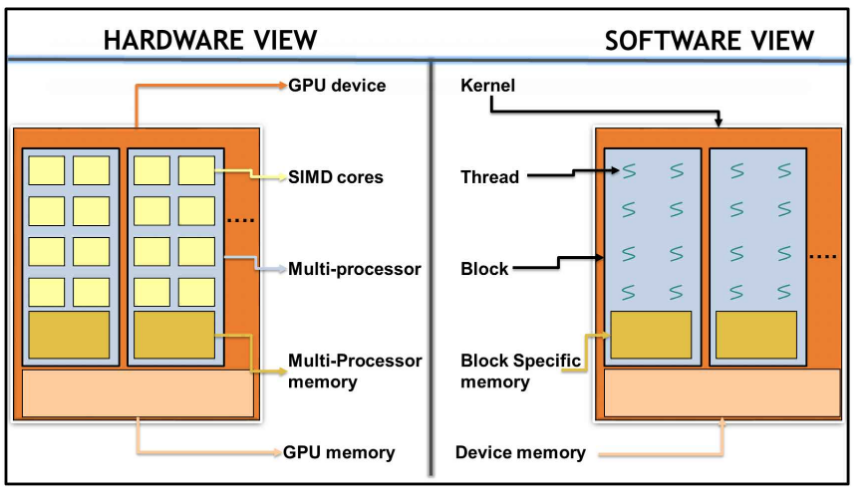

# 1.3 Hello World from CUDA
CUDA は CPU と GPU の両方に対して提供されている，ヘテロジニアス・プログラミング・モデルである．
CUDA の C/C++ プログラミング・インターフェイスはC言語を拡張したものなので，
ソースコードで デバイス (デバイス) 上での並列実行に対応する部分に的を絞ることができる．
業界標準の C/C++ に準拠しており，ホスト (CPU) 上で実行できるC言語の関数ライブラリが提供されているので，
デバイスとやり取りすることができる．

CUDA では互いに動作し合う2つのプロセッサがある．
通常，ホストは CPU を，デバイスは GPU を指す．
ホストはデバイスの関数呼び出しを担当する．
これまでも述べてきたように，GPU 上で走る部分のコードを**デバイス・コード (device code)**，
CPU 上で走る一連のコードを**ホスト・コード (host code)** と呼ぶ．

それでは，C言語で初めての CUDA コードを書いていこう．
システマチックに一歩ずつ進めていくため，繰り返しコードを書くことからはじめ，いくつかのキーワードを追加して
CUDA らしいコードに書き換えていく．
先程も述べたとおり，新たな言語を学ぶ必要はない．
必要なのは既存の言語にいくつかキーワードを追加するだけなので，CPU と GPU の混在するヘテロジニアス環境で
動作させることができる．

実際のコードを見ていこう．
次に示すコードで，CPU と GPU の両方から Hello World! を表示できる．

```c:hello_world.c
#include <stdio.h>
#include <stdlib.h>

__global__ void print_from_gpu(void) {
    printf("Hello World from thread [%d, %d]! From device\n", threadIdx.x, blockIdx.x);
}

int main(void) {
    printf("Hello World from host!\n");
    print_from_gpu<<<1,1>>>();
    cudaDeviceSynchronize();

    return 0;
}
```

続いてコンパイルして動かしてみよう．

1. コードをコンパイルする
   上記のコードを hello_world.cu として保存し，**NVIDIA C Compiler (NVCC)** を用いてコンパイルする．
   (.cu は CUDA のコードであることを表す拡張子)
   ```bash
   $ nvcc -o hello_world hello_world.cu
   ```

2. GPU コードの実行
   上記で生成された実行ファイルを実行すると，次のように表示される．
   ```bash
   $ ./hello_world 
   Hello World from host!
   Hello World from thread [0, 0]! From device
   ```

ここまでで，CUDA C は通常のC言語と大きく違うところはなく，どの関数が GPU で実行されるのか，
どうやって GPU 関数を呼び出すのかをコンパイラに示すコードを追加しているだけであることがわかる．
全く新しい言語を学ぶ必要はどうやらなさそうである．

上記のコードでは，次のようなコンストラクトやキーワードを追加している．

- \_\_global\_\_  
  関数の前に置いて，コンパイラにその関数がホスト上ではなくデバイス上で実行するものであることを示すキーワード．
  ただし，呼び出しはホストが行い，返り値の型は常に "void" でなければならない．
  アルゴリズムのデータ並列箇所がカーネルとしてデバイス上で実行される．
  
- <<<1,1>>>  
  コンパイラにホスト関数の呼び出しではなく，デバイス関数の呼び出しであることを示すキーワード．
  パラメータはカーネル内で立ち上げるスレッド数を指定している．
  パラメータの中身の数字については後述する．
  上記のコードでは1スレッドのカーネルを立ち上げており，文字列の表示以外何もしない単一スレッドの逐次処理コードである．

- threadIdx.x, blockIdx.x  
  全てのスレッドに割り当てられるユニークな ID である．
  詳細については次節で述べる．

- cudaDeviceSynchronize()  
  CUDA では，全てのカーネルが非同期に呼び出される．
  カーネルを呼び出したあと，ホストはフリーになるので次の命令の処理を開始できる．
  ヘテロジニアスな環境なので，利用可能なタイプのプロセッサを活用するために，
  ホストとデバイスが並列的に実行可能なのは至極当然である．
  ホスト側がデバイス処理の完了をを待つ必要がある場合，それを実現する CUDA の API が用意されている．
  ```cudaDeviceSynchronize()``` はそれ以前のデバイス関数の呼び出しが全て完了するまで，ホストを待機させる API である．


## 1.3.1 Thread hierarchy
ここでは，```threadIdx.x``` と ```blockIdx.x``` について見ていこう．

### 実験1
パラメータの指定値を ```<<<1,1>>>``` から ```<<<2,1>>>``` に変更してみる．
複数のブロックを持つ1つのスレッドが立ち上がり，プログラムが実行されて次のように表示される．

```bash
$ ./hello_world 
Hello World from host!
Hello World from thread [0, 0]! From device
Hello World from thread [0, 1]! From device
```

この実験からわかるように，1つのスレッドではなく2つのスレッドで値が表示される．

### 実験2
続いて，パラメータの指定値を ```<<<1,1>>>``` から ```<<<1,2>>>``` に変更してみる．
各スレッドにつき1つのブロックを持つ複数のスレッドが立ち上がり，プログラムが実行されて次のように表示される．

```bash
$ ./hello_world 
Hello World from host!
Hello World from thread [0, 0]! From device
Hello World from thread [1, 0]! From device
```

前の実験と同様に，カーネルに立ち上がるスレッドの数は2つだが，異なる ID を持つ点で結果が異なる．
それでは，このスレッドとブロックとはどのような概念なのだろうか？
これを解き明かすために，もう少し GPU のアーキテクチャを詳しく見ていこう． 


## 1.3.2 GPU architecture
CUDA にとても人気がある理由の一つは，ハードウェアとソフトウェアがアプリケーションで最高のパフォーマンスを
発揮できるように，密接につながるような設計がなされていることである．
ソフトウェア (CUDA プログラミングのコンセプト)とハードウェアの設計の関係性を示す必要があるだろう．

以下に，CUDA をソフトウェアとハードウェアの両面から見た図を示す．
CUDA のソフトウェアが GPU のハードウェアをよく反映していることがわかる．



次のテーブルに，CUDA プログラミング・モデルにおけるソフトウェアとハードウェアの対応関係を示す．

|ソフトウェア|ハードウェア|
|:--:|:--:|
|CUDA thread|CUDA Core / SIMD code|
|CUDA block|Streaming multiprocessor|
|GRID / kernel|GPU device|

それぞれについて詳しく見ていく．

### CUDA Threads
CUDA スレッドは CUDA コア上で実行される．
CUDA スレッドは CPU のスレッドとは異なる．
CUDA スレッドは非常に軽量で，高速なコンテキスト・スイッチングが行われる．
高速なコンテキスト・スイッチングが可能なのは，GPU 内で大量のレジスタと，
ハードウェア・ベースのスケージューラが使えるからである．
CPU ではスレッドのハンドルが低次の階層のキャッシュに置かれている一方で，
スレッドのコンテキストがレジスタに保存される．
したがって，あるスレッドがアイドルまたは待機の状態にあるとき，
ほとんど遅延なくすぐに使用可能な他のスレッドで実行を開始できる．
各 CUDA スレッドは，同じカーネルを独立に異なるデータについて実行しなければならない．(SIMT)

### CUDA block
CUDA スレッドは CUDA ブロックと呼ばれる論理要素でグルーピングされる．
CUDA ブロックは単一の**ストリーミング・マルチプロセッサ (SM: Streaming Multiprocessor)** 上で実行される．
1つのブロックは1つの SM 上で実行されるとは，すなわち，あるブロック内のスレッドは単一の SM のコア上でのみ実行でき，
他の SM 上のコアでは実行できないことを示している．
GPU には1つ以上の SM を持ち，効率的に GPU 全体を使いこなすには，
並列計算をうまくブロックやスレッドに分割する必要がある．

### GRID / kernel
CUDA ブロックは，さらに GRID と呼ばれる論理要素にまとめられる．
そして，CUDA GRID はデバイス上で実行される．

初めてこれを見た人は，少々複雑に感じるかもしれない．
次節では，ここまでの話を説明するために，ベクトルの足し算を見ていく．
よりはっきり理解できるようになることを祈っている．