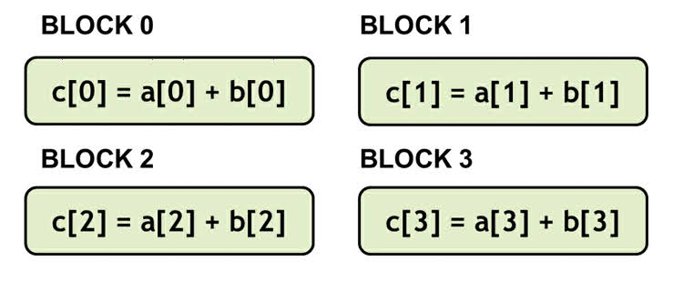
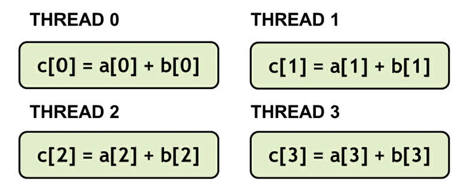
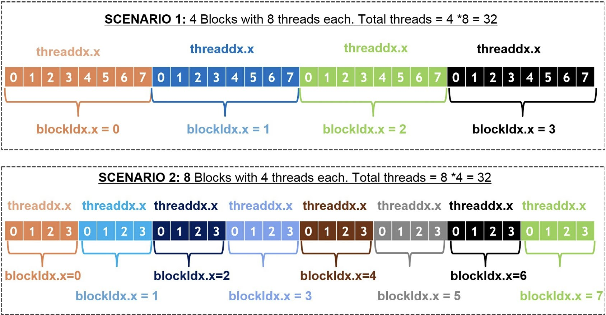
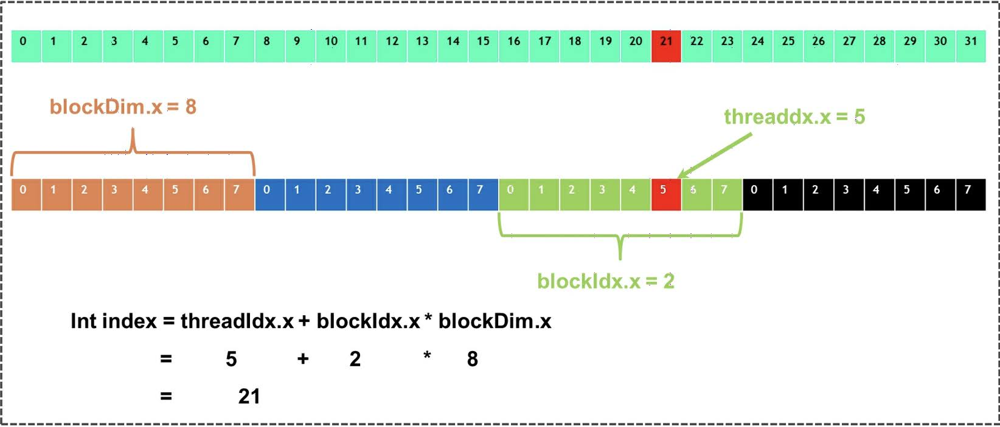
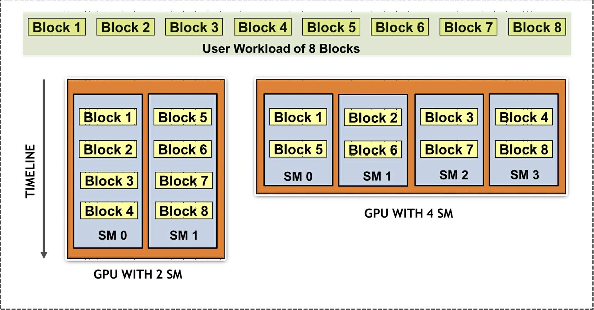

# 1-4 Vector addition using CUDA
ここで扱うのはベクトル加算の問題である．
お察しの通り，**ベクトル (vector)** 加算はデータ並列の処理である．
データセットは3つの配列 $A$ と $B$，$C$ からなる．
同じ処理を各要素に行う．

$$
Cx = Ax + Bx
$$

それぞれの加算処理は独立だが，全ての CUDA スレッドに同じ処理を適用している．
次のように自分の環境を整える．

1. GPU アプリケーションを用意する  
   code/0x_vector_addition ディレクトリ以下にコードを作成．
1. nvcc で上記のコードをコンパイルする  
   ```bash
   $ nvcc -o vector_addition vector_addition.cu
   ```
[vector_addition.cu](code/vector_addition/vector_addition.cu) の繰り返し処理のコードを GPU で実行できるように，
少しずつ変更していく．
繰り返し処理のコードをいじる前に，CUDA と繰り返し処理で基本的な変更を加える箇所と処理手順を確認しておこう．

### 繰り返しコード
- Step 1  
  ```malloc new``` を用いて CPU 上でメモリを割り当てる．
- Step 2  
  CPU データに書き込み，初期化を行う．
- Step 3  
  データの処理を行う CPU 関数を呼び出す．
  今回扱うアルゴリズムはベクトル加算である．
- Step 4  
  処理したデータを使う．
  ここでは表示させる．

### CUDA コード
- Step 1  
  ```malloc new``` を用いて CPU 上でメモリを割り当てる．
- Step 2  
  ```cudaMalloc``` を用いて GPU 上でメモリを割り当てる．
- Step 3  
  CPU データに書き込み，初期化を行う．
- Step 4  
  ```cudaMemcpy``` でデータをホストからデバイスに移す．
- Step 5  
  ```<<<,>>>``` ブラケットで GPU 関数を呼び出す．
- Step 6  
  ```cudaDeviceSynchronize``` でデバイスとホストを同期する．
- Step 7  
  ```cudaMemcpy``` でデータをデバイスからホストに移す．
- Step 8  
  処理したデータを使う．
  ここでは表示させる．

このように，CUDA による処理には繰り返し処理に，次のようないくつかステップを追加する必要がある．

1. GPU 上でのメモリ割当  
   CPU のメモリと GPU のメモリは物理的に分離されている．
   ```malloc``` は CPU RAM 上でメモリの割当を行う．
   GPU のカーネル関数やデバイス関数は，デバイス・メモリ上に割り当てられた，
   または指し示すメモリにしかアクセスできない．
   GPU 上のメモリを確保するには，```cudaMalloc``` API を使う必要がある．
   ```malloc``` コマンドとは異なり，```cudaMalloc``` は割り当てられたメモリのポインタを返さない．
   その代わり，パラメータとしてポインタの参照を取り，同様に割り当てられたメモリのアップデートを行う．
2. ホスト・メモリからデバイス・メモリへのデータ移植  
   ホスト上のデータが ```cudaMalloc``` で割り当てられたデバイス上のメモリにコピーされる．
   ホストとデバイスの間でデータをコピーするのに使う API は ```cudaMemcpy``` である．
   ```memcopy``` コマンド同様，コピー先のポインタ，コピー元のポインタ，データサイズを指定する必要がある．
   加えてもう1つ，ホストからデバイスにコピーするのか，デバイスからホストにコピーするのかを指定する
   パラメータを渡す必要がある．
   最新の CUDA では，ドライバが指定されたポインタがホスト上のメモリなのか，
   デバイス上のメモリなのかを判定してくれるので，コピー方向の指定はオプションになっている．
   ```cudaMemcpy``` の代わりに非同期に行うコマンドもあるが，これはあとの章で詳しく述べる．
3. CUDA 関数の呼び出しと実行  
   Hello World を表示させたときのように，ブロック数とスレッド数を指定する ```<<<,>>>``` ブラケットを用いて
   カーネルを呼び出す．
   これについては，各ステップがの説明が終わったあとに詳しく述べる．
4. 同期  
   Hello World のときも述べたように，カーネルは非同期的に呼び出される．
   ホストがカーネルの実行を確実に完了させるために，ホスト側で ```cudaDeviceSynchronize``` 関数を呼び出す．
   これによって，デバイス側での呼び出しが確実に全て完了する．
5. デバイス・メモリからホスト・メモリへのデータ移植  
   画面への表示のような後処理や評価のために，デバイスからホストに ```cudaMemcpy``` API を使ってデータを戻す．
   唯一，最初の手順と違うのは，コピーの向きが逆になる，つまり，コピー先のポインタがホスト，コピー元がデバイス上の
   割り当てられたメモリのポインタとなることである．
6. GPU メモリの解放  
   最後に，割り当てた GPU メモリを ```cudaFree``` AAPI を使って解放する．

上記を踏まえて，[vector_addition.cu](code/vector_addition/vector_addition.cu) のメイン関数を変更し，
[vector_addition_gpu.cu](code/vector_addition/vector_addition_gpu.cu) のように書き換える．
それでは，カーネルがどのように記述され，スレッドとブロックのサイズを管理しているのか調べるために，
いくつか実験をしていこう．


## 1.4.1 Experiment 1 - creating multiple blocks
この節では，GPU 上で並列的にベクトルの加算を実行するため，CUDA ブロックを用いる．
CUDA ブロックにどのようにインデックスをつけられるのかに関連したキーワードを追加する．
```device_add``` 関数の呼び出し部を次のように変更する．

```c
device_add<<<N, 1>>>
```

これによって，```device_add``` 関数が1回ではなく並列に N 回実行される．
```device_add``` 関数のそれぞれの並列計算は，ブロックとして参照される．
ここでは，次のような ```__global__``` デバイス関数を追加する．

```c
__global__ void device_add(int *a, int *b, int *c)
{
    c[blockIdx.x] = a[blockIdx.x] + b[blockIdx.x];
}
```

配列のインデックスに ```blockIdx.x``` を用いることで，各ブロックが異なる配列要素の操作を行っている．
デバイスでは，次の図のように各ブロックが並列に実行できる．
各ブロックが単一のスレッドからなる複数のブロックにインデックスを付与しているのを表した，
ベクトル加算の GPU コードを示している．



## 1.4.2 Experiment 2 - creating multiple threads
この節では，GPU 上で並列的にベクトル加算のコードを実行するために，CUDA スレッドを用いる．
CUDA スレッドにどのようにインデックスをつけられるのかに関連したキーワードを追加する．

1つのブロックは複数のスレッドに分割できる．
```device_add``` 関数の呼び出し部を次のように変更する．

```c
device_add<<<1, N>>>
```

これによって，```device_add``` 関数が1回ではなく並列に N 回実行される．
```device_add``` 関数のそれぞれの並列計算は，スレッドとして参照される．
ここでは，次のような ```__global__``` デバイス関数を追加する．

```c
__global__ void device_add(int *a, int *b, int *c)
{
    c[threadIdx.x] = a[threadIdx.x] + b[threadIdx.x];
}
```

重要なのは，```blockIdx.x``` の代わりに，次の図のように ```threadIdx.x``` を用いる．
各ブロックが複数のスレッドからなる単一のブロックにインデックスを付与しているのを表した，
ベクトル加算の GPU コードを示している．



## 1.4.3 Experiment 3 - combinig blocks and threafs
ここまで，1.4.1 節では単一スレッドでいくつかのブロックを用いて，1.4.2 節では単一ブロックでいくつかのスレッドを用いて
ベクトル加算の並列計算を行う実験を見てきた．
ここで行う実験では，複数のスレッドを含む分割された複数のブロックを用いる．
ユニーク ID を生成するため，```threadIdx``` と ```blockIdx``` を組み合わせる必要があるため，
インデックスの発見がより難しくなる．

開発者は，次の2つの異なる組み合わせのやり方から選ぶことができる．

- Senario 1  
  32個の要素を持つベクトルを考える．各ベクトルに8スレッドを含む4個のブロックを用いる．
- Senario 2  
  32個の要素を持つベクトルを考える．各ベクトルに4スレッドを含む8個のブロックを用いる．

いずれの場合にも，並列実行数は32で，32個の要素は並列に処理される．
開発者は，問題のサイズとハードウェアの制約をもとに，ブロック内のスレッド数とブロック数を決める．
アーキテクチャによる正しいサイズの選択については，別の章で扱う．

次の図は，異なるブロックとスレッドの構成での，ベクトル加算の GPU インデクシング・コードを表す．



それでは，スレッドとブロックを両方用いる場合に，グローバルなインデックスを計算するカーネルコードを見ていこう．

```
__global__ void device_add(int *a, int *b, int *c)
{
    int index = threadIdx.x + blockIdx.x * blockDim.x;
    c[index] = a[index] + b[index];
}
```

カーネルがメイン関数から呼び出されたとき，次に示すとおり，開発者はブロックとスレッドの構成を選択する．

- Senario 1  
  1つのブロックに8スレッドとして計算する場合．
  
  ```c
  threads_per_block = 8;
  no_of_blocks = N / threads_per_block;
  device_add<<<no_of_blocks, threads_per_block>>>(d_a, d_b, d_c);
  ```

- Senario 2  
  1つのブロックに4スレッドとして計算する場合．
  ```c
  threads_per_block = 4;
  no_of_blocks = N / threads_per_block;
  device_add<<<no_of_blocks, threads_per_block>>>(d_a, d_b, d_c);
  ```

スレッドとブロックを両方用いる場合，スレッドのユニーク ID を計算することが可能である．
前述のコードに示したとおり，新しい変数が全てのスレッドに与えられている．
これは ```blockDim``` と呼ばれる．
この変数はブロックの次元，すなわち，ブロックあたりのスレッド数からなる．
次の図のように，Senario 1 ではベクトル加算の GPU 上での インデックスを計算することができる．




## 1.4.4 Why bother with threads and blocks
おそらく，スレッドとブロックというさらなる階層構造がどうして必要なのか，明確ではないだろう．
スレッドとブロックの概念は，開発者が正しいブロックとグリッドのサイズ理解するのに，
余計に複雑にしてしまっている．
っまた，グローバルなインデックスの計算を難しくしている．
これは，CUDA のプラグラミングモデルを実践するにあたって，制約があるためである．

並列なブロックとは異なり，スレッドには効果的に情報伝達を行い同期する仕組みがある．
実世界のアプリケーションでは，スレッド同士が情報伝達を行い，先の処理に進む前にあるデータを交換したい場面がある．
この種の処理はスレッド感で情報の伝達を行う必要があり，CUDA のプログラミングモデルでは同一ブロック内のスレッドに，
この情報伝達ができるようにしている．
カーネルの実行中，異なるブロックに属するスレッドは，互いに情報伝達や同期を行うことができない．
この制約によって，スケジューラが SM 上のブロックのそれぞれについて，独立にスケジュールできるようになる．
その結果，SM を増設したハードウェアが登場した場合に，十分に並列的なコードであれば，
そのコードが線形にスケールするようになる．
つまり，ハードウェアが GPU の能力に応じて，走らせるブロックの数をスケールさせられるようになる．

スレッドは，共有メモリとして知られる特別なメモリを用いて互いに情報伝達を行う．
共有メモリに関しては，GPU 内の他の階層のメモリや最適な使い方も含めて，
[第2章](../02_CUDA_Memory_Management)で広く扱う．
次の図は，SM 数の異なる GPU にまたがってブロックがスケーリングすることを表している．



それでは，複数の次元でのカーネルの立ち上げについてもっと見ていこう．


## 1.4.5 Launching kernels in multiple dimentions
ここまで，単一次元でスレッドとブロックを立ち上げてきた．
これは，1次元のインデックスしか使えないことを意味する．
たとえば，```threadIdx.x``` では，x 方向の次元のスレッド・インデックスしか使えない．
同様に，```blockIdx.x``` も，x 方向の次元のブロック・インデックスしか使えない．
スレッドとブロックは，1次元，2次元，および3次元で立ち上げることができる．
スレッドとブロックを2次元で立ち上げる例としては，フィルタを使って画像にブラーをかける場合などで
並列処理を行うことが挙げられる．
開発者はスレッドとブロックを2次元で立ち上げる選択ができるが，もともと2次元の画像を扱う場合には
2次元での立ち上げを選択するのがより自然である．

また，スレッドとブロックの次元について，GPU アーキテクチャごとに制限が設けられていることを
司会しておくことも重要である．
例えば，NVIDIA Pascal カードでは，x 方向と y 方向の次元には最大1024スレッドを立てられるが，
z 方向には64スレッドしか立てられない．
同様に，グリッド内にブロック数はは，y 方向と z 方向で最大65535個に，x 方向は $2^{31} - 1$ 個に制限されている．
もし，サポートされていない次元のカーネルを立ち上げようとすると，アプリケーションはランタイムエラーを吐く．

ここまで，コードはエラーがないことを前提に話をしてきた．
しかし，実際には全てのコードにはバグがあり，エラーを捕捉する必要がある．
次節では，CUDA でのエラー報告について見ていく．