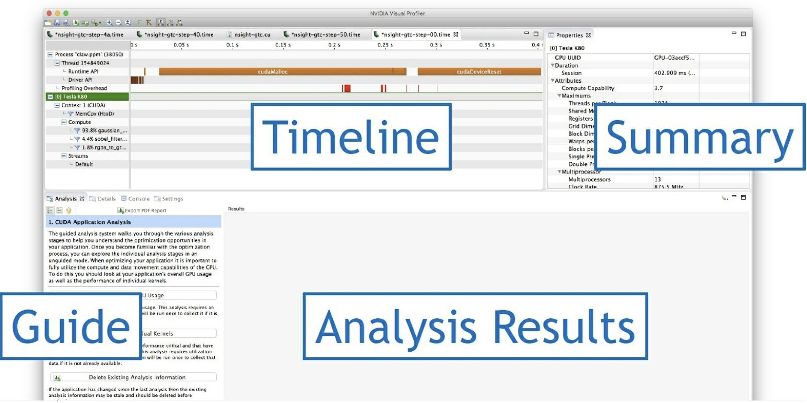

# 2.1 NVIDIA Visual Profile
様々な階層のメモリの効果的な活用方法を理解するため，アプリケーションの実行時の特性を解析することが重要である．
プロファイラは，メモリ，SM，コア，そしてその他のリソースがどのように使われているのか解析するのに，
様々な指標で計測や表示を行える便利なツールである．
NVIDIA は CUDA のアプリケーションをフックできるプロファイラ・ツールを開発者に提供しており，
TAU Performance system や Vampir Trace，HPC Toolkit のようなプロファイリング．ツールが開発されてきた．
これらは全て，CUDA アプリケーションにプロファイリング情報を提供する 
**CUDA Profiler Tools Interface (CUPTI)** を使用している．

NVIDIA 自身も CUDA Toolkit の一部として，プロファイリング・ツールを開発・メンテナンスしている．
この章では， NVPROF と NVVP の2つのプロファイリング．ツールを活用して，
様々なメモリタイプの効果的な使い方を示す．
ツールの手引書ではない．

NVPROF または NVVP のどちらかを用いて，CUDA アプリケーションの特性を示す．
NVPROF はコマンドライン・ツールで，NVVP はGUI から操作できる．
NVVP はスタンドアロンのバージョンと Nsight Eclipse 内に統合されたバージョンの2種類が提供されている．

ここでよく使う NVVP Profiler のウィンドウハ次の図のとおりである．
画像は macOS 上の NVVP version 9.0 のウィンドウである．



ウィンドウはTimeline，Guide，Analysis Results，Summary の4つのビューに分かれている．

Timeline のビューは，その名前が示すとおり，時間ごとに CPU と GPU のアクティビティが表示される．
Visual Profiler は CUDA プログラミングモデルのメモリ階層構造のサマリビューを表示する．
Analysis のビューには，解析結果が表示される．
Visual Profiler は，次の2つの解析モードを提供している．

- Guided analysis  
  名前の通り，段階を踏んでパフォーマンスを制限している重要な箇所を見ていく．
  Unguided モードに移行する前に，一旦様々な指標を理解するために，初心者はこのモードから始めることが望ましい．
- Unguided analysis  
  パフォーマンスのボトルネックを自分で探さなければならない．

CUDA Toolkit は **NVIDIA Profiler (NVPROF)** と **NVIDIA Visual Profiler (NVVP)** の2種類の GPU アプリケーション
プロファイルツールを提供している．
パフォーマンスの制約になっているところの情報を得るには，
タイムライン解析とメトリック解析の2種類のプロファイリングをみる必要がある．
[サンプルコード](./code/01_sgemm/sgemm.cu) を使う場合，次のようにプロファイリングを実行できる．
(sudoer で実行しないとエラーになるっぽい)

```bash
$ nvcc -o sgemm sgemm.cu -I /usr/local/cuda/samples/common/inc
$ sudo nvprof -o sgemm.nvvp ./sgemm
$ sudo nvprof --analysis-metrics -o sgemm-analysis.nvpp ./sgemm
```

それでは Visual Profiler を開いてみよう．
ターミナルから ```nvvp``` コマンドで起動できる．
表示されたウィンドウの左上にある File → Inport と進み，Nvprof を選択して Next ボタンを押す．
このプログラムでは，1プロセスしか使っていないので，Single process を選択して Next を押す．

続いて，Visual Profiler に収集したプロファイルデータを取り込む．
Timeline data file の右の Browse... ボタンから Timeline データを，Event/Metrics data files から Metric analysis の
データを取り込む．

Windows 環境であれば，スタートメニューから NVIDIA Visual Profiler を起動できる．
これで，解析ツールの使い方は理解できたであろう．
それでは，最初に最も重要な GPU メモリ，グローバルメモリとデバイスメモリについて見ていこう．