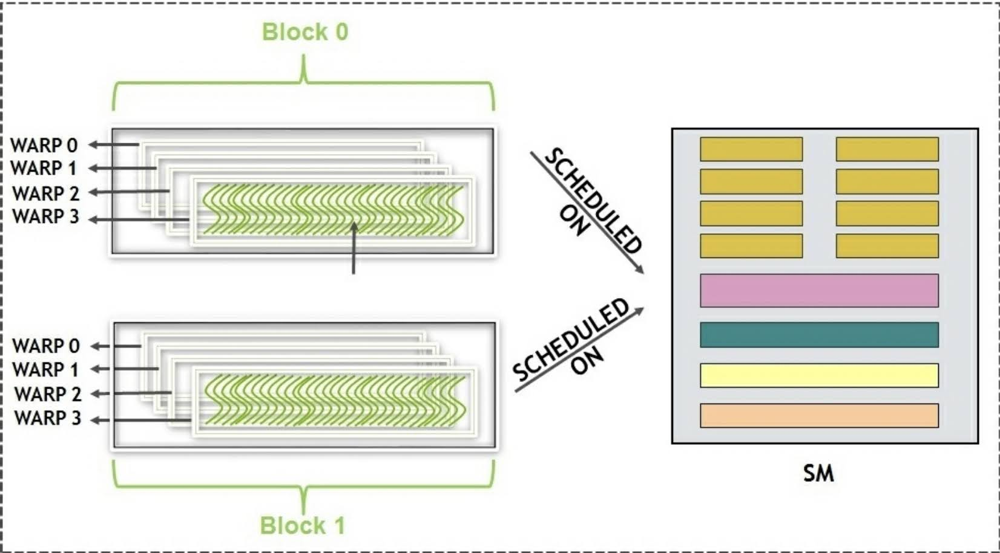
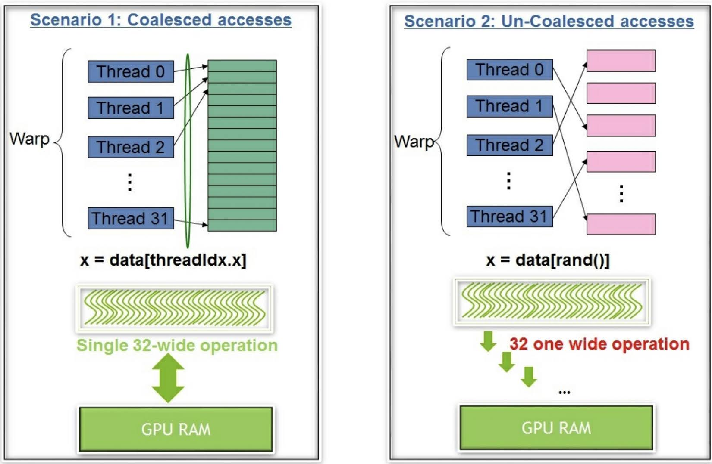
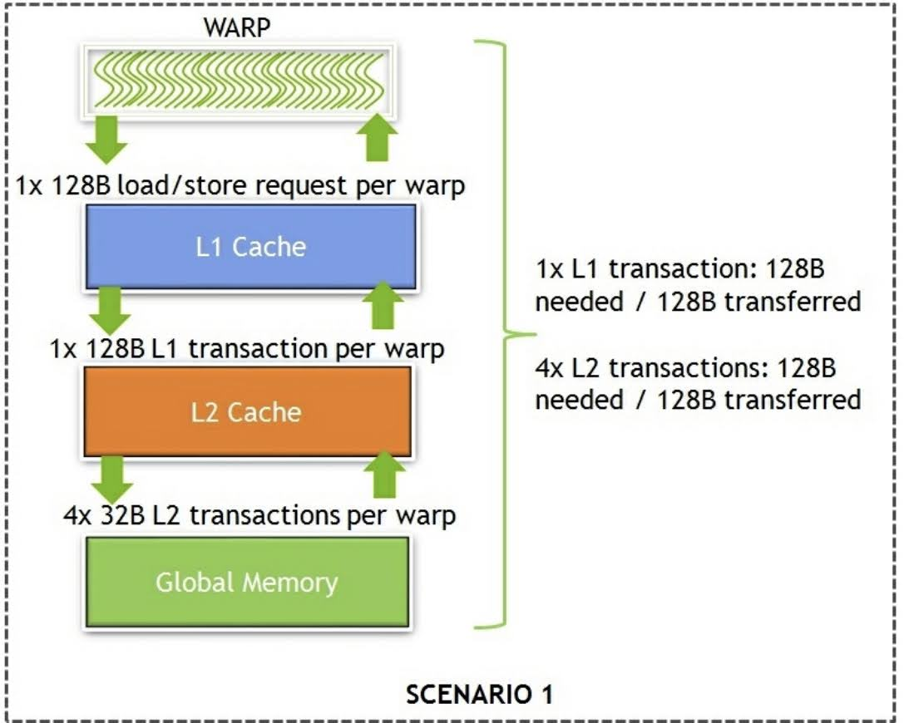
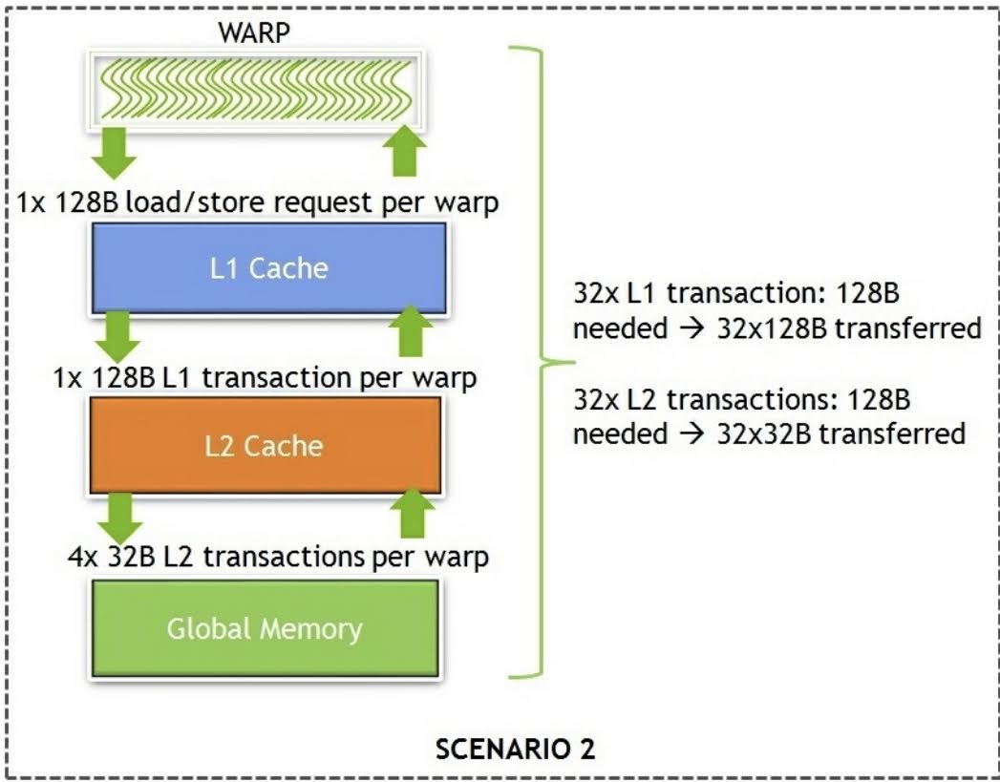
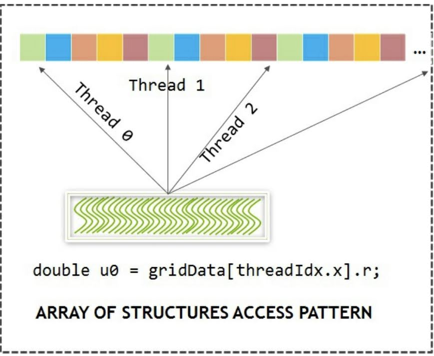
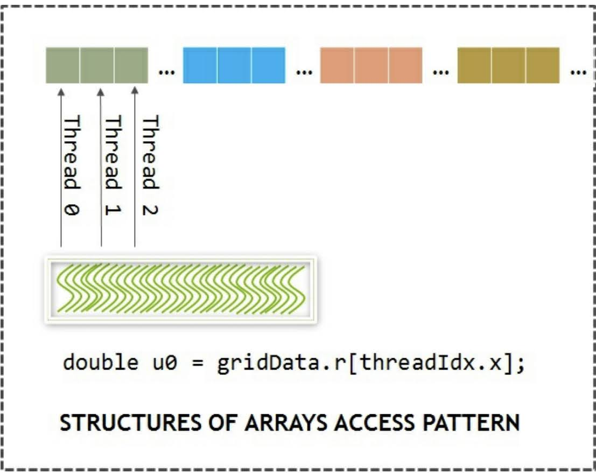
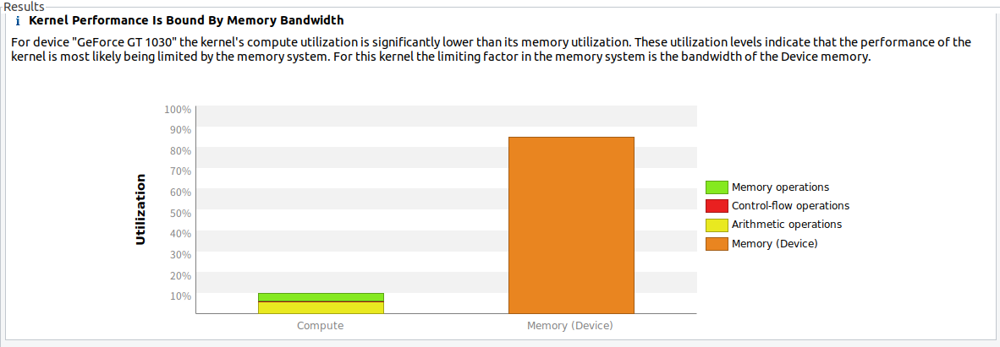
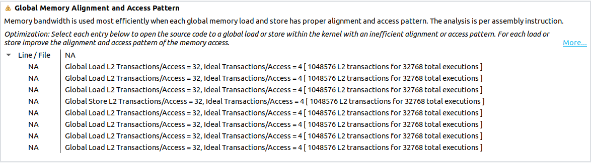
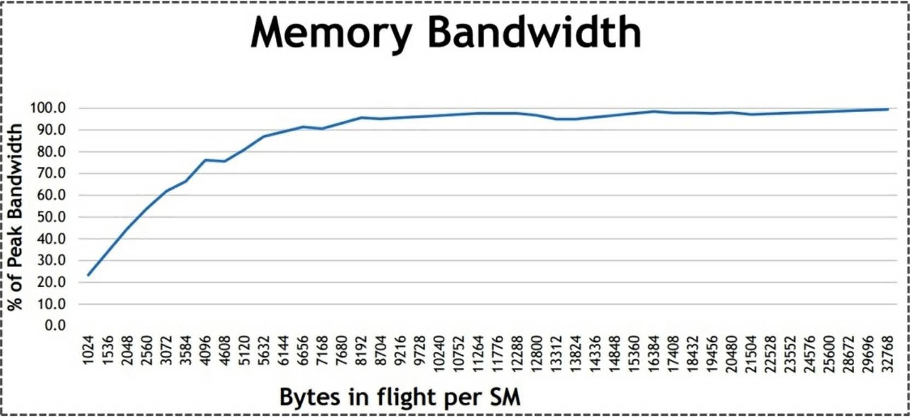

# 2.2 Global memory / device memory
この節では，グローバルメモリとデバイスメモリの詳しい使い方について見ていく．
また，グローバルメモリからキャッシュに効果的にデータをロード，ストアする方法についても見ていく．
グローバルメモリは CPU メモリから全てのデータをステージングする場所なので，
うまくこのメモリを使いこなすのは非常に重要である．
グローバルメモリとデバイスメモリは，カーネル内のスレッド全てから参照できる．
また，CPU からも参照可能である．

プログラマは ```cudaMalloc``` と ```cudaFree``` を使って割当と解放を明示的に行う必要がある．
データは ```cudaMalloc``` で割り当てられ，```__device__``` として宣言される．
グローバルメモリはデフォルトで ```cudaMemcpy``` API を使って CPU から送られてきた
全てのデータをステージングする場所である．


## 2.2.1 Vector addition on global memory
ベクトル加算のレイは最初の章でも扱ったが，ここではグローバルメモリの使い方について見ていく．
次のコードから，どのようにグローバルメモリを使っているのか見てみよう．

```c
__global__ void device_add(int *a, int *b, int *c)
{
    int index = threadIdx.x + blockIdx.x * blockDim.x;
    c[index] = a[index] + b[index];
}

int main(void)
{
    ...

    // a, b, c に対応する GPU メモリを確保
    cudaMalloc((void **)&d_a, size);
    cudaMalloc((void **)&d_b, size);
    cudaMalloc((void **)&d_c, size);

    ...

    // GPU メモリの解放
    cudaFree(d_a);
    cudaFree(d_b);
    cudaFree(d_c);

    ...
}
```

```cudaMalloc``` はデバイスメモリ上のデータ領域を割り当てる．
カーネルのポインタ引数 a，b，c は，このデバイスメモリを指している．
そして，このメモリは ```cudaFree``` API を使って解放する．
見てわかるように，ブロック内の全てのスレッドは，カーネル内のこのメモリにアクセスしている．

[ベクトル加算のコード](./code/02_vector_addition/vector_addition_gpu_thread_block.cu)は次のようにコンパイルできる．

```bash
$ nvcc -o vector_addition vector_addition_gpu_thread_block.cu
```

これが，簡単なグローバルメモリの使い方の例である．
次節では，最適なデータアクセスの方法を見ていく．


## 2.2.2 Coalesced versus uncoalesced global memory access
グローバルメモリを効果的に使うには，これまでは無視してきたが，
CUDA プログラミングモデルにおけるワープの概念を理解することが重要である．
ワープは SM 内でスレッドのスケジュールと実行を行うユニットである．
一旦ブロックが SM に割り当てられると，**ワープ (warp)** と呼ばれる32スレッドをまとめたユニットに分割される．
これが，CUDA プログラミングにおける基本的な実行単位になる．

ワープの概念をはっきりさせるために，簡単な例を見てみよう．
128スレッドを持つ2つのブロックが SM に割り当てられたとき，各ブロック内のワープ数は $128 / 32 = 4$ 個で，
SM 上のワープ数は合計で $4 \times 2 = 8$ 個である．
次の図は，GPU の SM 上でどのように CUDA のブロックが分割され，スケジューリングされるのかを表している，



ブロックとワープがどのように SM と そのコア上でスケージュルされるかは，Kepler や Pascal，そして最新の Volta 
アーキテクチャのように，アーキテクチャ依存で世代によって大きく異なる．
ここまで，スケジューリングについては無視できた．
使用可能な全てのワープの中で，次の実行される準備のできた演算子を持ったワープが実行対象に選ばれる．
CUDA のプログラムが実行されている GPU のスケジューリング・ポリシーに基づいて，実行されるワープが選ばれる．
CUDA は **Single Instruction Multiple Thread (SIMT)** モデルである．
つまり，ワープ内の全てのスレッドは，同時に同じ命令を読み出して実行している．
グローバルメモリから最適なアクセスを行うには，アクセスが結合して (coalesce) いる必要がある．
Coalesce と Uncoalesce の違いは次のとおりである．

- Coalesce global memory access : 隣接するメモリに逐次的にアクセス
- Uncoalesce global memory access : 隣接していないメモリに逐次的にアクセス

下図は2種類のアクセス方法の詳細な例である．
左側は，ワープからスレッドが隣接したデータにアクセスし，32個分を一括で取得し，1度のキャッシュミスで済む，
結合アクセスを表している．
右側は，ワープ内のスレッドがランダムに並んだデータにアクセスし，最悪の場合，32個を個別に呼び出す必要があり，
32回のキャッシュミスを起こしてしまう場合を表している．



さらにこの概念をよく理解するためには，データがどのようにグローバルメモリからキャッシュラインを通って
到達するか理解する必要がある．

### Senario 1 : ワープが4バイトの順番に並んだ32個のデータを要求したとき
アドレスは1つのキャッシュラインと32個一括の処理で済む．
バスの使用率は100%で，グローバルメモリからキャッシュに読み出したデータ全てが使われており，
帯域幅は全く無駄になっていない．
メモリのアクセスは次の図のように行われ，バスを最適に使いこなせている．



### Senario 2 : ワープが4バイトのランダムに並んだ32個のデータを要求したとき
ワープが必要とするのは128バイトだが，実行中，1個ずつ32回読み出しを行っており，
バスを $32 \times 128$ バイトのデータが移動することになる．
次の図のように，バスの使用効率は1%未満になってしまい，非結合アクセスはバスの帯域幅を無駄にしていることがわかる．



ここまでの図を見てもわかるように，ワープ内のスレッドがどのようにグローバルメモリからデータにアクセスするかは
重要である．
グローバルメモリを最適に使いこなすためには，結合性を改善することが重要となる．
いくつかやり方はあるが，一つのやり方としては，配置を改善するようにデータレイアウトを変更する方法がある．
1つ例を見てみよう．
画像にフィルタをかけたり，マスクをかけたりするコンピュータビジョンのアルゴリズムでは，
画像をデータ構造に格納する必要がある．
イメージ型の宣言には2つの選択肢がある．

次のコードはデータを配列の形式で格納する ```Coefficients_SOA``` を使っている．
このデータ構造には，画像に関連した RGB や色調，彩度などのデータが格納されている．

```c
struct Coefficients_AOS {
    int r;
    int g;
    int b;
    int hue;
    int saturation;
    int maxVal;
    int minVal;
    int finalVal;
};
```

次の図は，```Coefficients_AOS``` にどのようにデータが格納され，カーネルのそれぞれんのスレッドに
どのようにアクセスされているのかを考慮した，データレイアウトを示している．



こうすることで，AOS (Array of Structire) データ構造の使い方が，
グローバルメモリが非結合アクセスになってしまうことがわかる.

同じ画像を，次のように配列構造体の形式で格納することもできる．

```c
struct Coefficients_SOA {
    int *r;
    int *g;
    int *b;
    int *hue;
    int *saturation;
    int *maxVal;
    int *minVal;
    int *finalVal;
};
```

次の図は，```Coefficients_SOA``` にどのようにデータが格納され，カーネルのそれぞれんのスレッドに
どのようにアクセスされているのかを考慮した，データレイアウトを示している．



こうすることで，SOA (Structire of Array) データ構造の使い方が，
グローバルメモリが結合アクセスになっていることがわかる.

CPU の逐次実行コードではキャッシュ効率的に AOS が好ましいが，CUDA のような **SIMT** モデルでは，
実行やキャッシュ効率的に SOA の方が好ましい．

プロファイラを用いてこのことを解析してみよう．
次のようなステップに従って環境の構築を行う．

1. GPU アプリケーションを準備する．
   例として，グローバルメモリの効率的な使い方をデモする2種類のコードを扱う．
   aos_soa.cu は AOS データ構造を用いてナイーブに実装した[コード](code/02_soa_aos/aos_soa.cu)で，
   aos_soa_solved.cu は効率的にグローバルメモリを使うことのできる SOA データ構造を使った
   [コード](code/02_soa_aos/aos_soa_solved.cu)である．
2. ```nvcc``` でアプリケーションをコンパイルし，```vnprof``` でプロファイルを出力する．
   次のコマンドでコンパイルを実行する．
   ```bash
   $ nvcc -o aos_soa ./aos_soa.cu
   $ sudo nvprof --analysis-metrics --export-profile aos_soa.nvvp ./aos_soa
   $ nvcc -o aos_soa_solved ./aos_soa_solved.cu
   $ sudo nvprof --analysis-metrics --export-profile aos_soa_solved.nvvp ./aos_soa_solved
   ```
3. 出力されたプロファイルデータを NVIDIA Visual Profiler にロードする．
   ウィンドウの File → Import からファイルを読み込む必要がある．

プロファイルを読み込むと次のようなグラフが表示される．(AOS データ構造の場合) 



出力されたグラフから，明らかにアプリケーションがメモリに制約を受けている．
プロファイラにはメトリックだけではなく，そのメトリックが何を意味するのかまで解説されている．
この例では，AOS を使っているため，プロファイラは明らかにアクセス方法が非効率的であることを示している．
しかし，なぜコンパイラはこの結論に至ったのだろうか？



上の画像のように，1アクセスあたりのトランザクション数は，理想的には4であるが，実際には32も走っている．

データ構造を AOS から SOA に変更すると，ボトルネックは解消される．
aos_soa_solved を実行すると，カーネルの実行時間が大きく短縮されていることがわかる．
GT1030 では 1.74ms から 0.83ms に約2.1倍にスピードアップしている．
プロファイラの出力では，aos_soa_solved でもメモリに制約を受けていると表示される．
これは明らかに，計算をするよりメモリの読み書きを多く行っているからである．

## 2.2.3 Memory throughput analysis
アプリケーションのメモリ・スループットについて理解することが重要となる．
これは，2通りの方法で定義できる．

- アプリケーションの観点
  アプリケーションに要求されるバイト数
- ハードウェアの観点
  ハードウェアによって動かされるバイト数

上記の2つは全く異なる数字である．
これには，非結合アクセスが全てのトランザクションを専有するわけではないことや，メモリバンクのコンフリクトなど，
多くの理由がある．
メモリの観点からアプリケーションの解析を行うには次に2つの側面を用いる必要がある．

- アドレスパターン
  実際のコードでアクセスパターンを決定するのは非常に難しく，プロファイラのようなツールの使い方はとても重要である．
  プロファイラの出力する，グローバルメモリの効率や，1アクセスあたりの L1/L2 トランザクションのような指標を，
  注意深くみる必要がある．
- 実行中の同時アクセス数
  GPU はレイテンシを隠蔽するアーキテクチャなので，メモリ帯域を飽和させることが重要となる．
  しかし，同時アクセス数を決定することは，一般的には不可能である．
  また，ハードウェアから見たスループットは，理論値よりも更に大きく異なる．

以下に示すグラフから，Volta アーキテクチャでは，実行中に SM あたり約 6KB のデータの移動があれば，
ピーク値で帯域幅の90%に達することがわかる．
前世代のアーキテクチャでは，この実験結果も異なるグラフになる．
一般的に，GPU から最高の性能を引き出すためには，特定のアーキテクチャにおけるメモリの特性を理解しておいたほうが良い．



本節では，グローバルメモリの使い方の例と，最適な使用方法について見てきた．
グローバルメモリからの結合アクセスが難しいこともある．
(たとえば，CFD 分野やグリッドが不定形な場合には，近接するセルのデータがメモリ上で隣接していないことがある．)
この問題を解決したり，パフォーマンスへの影響を減らすためには，共有メモリと呼ばれる他のメモリを使う必要がある．