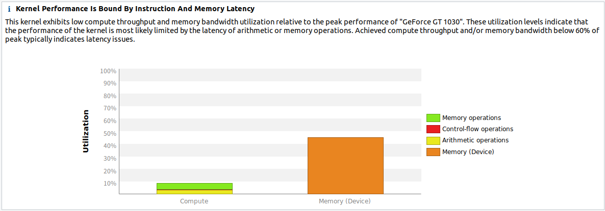
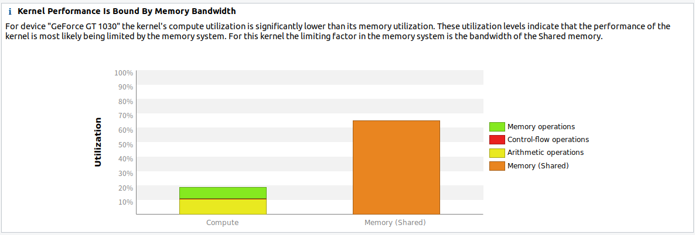
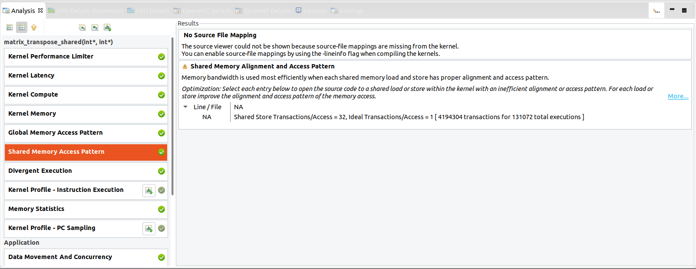
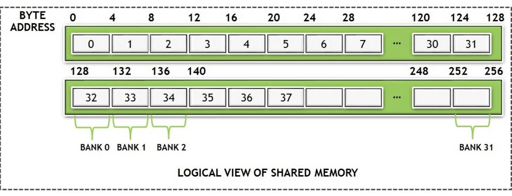
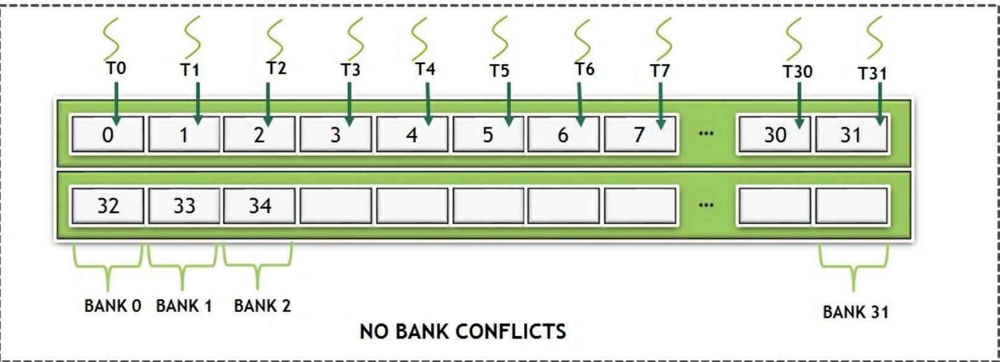
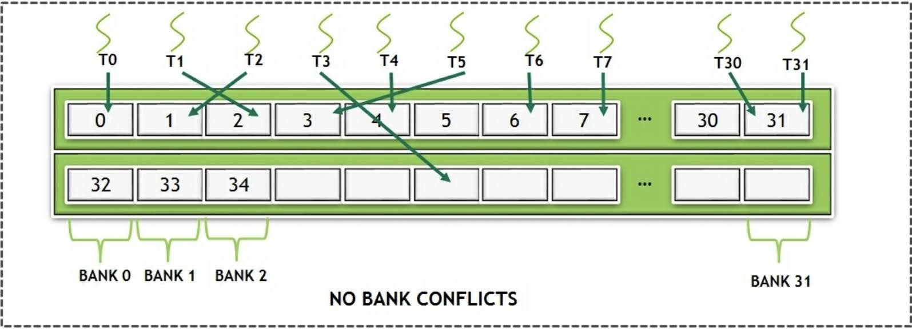
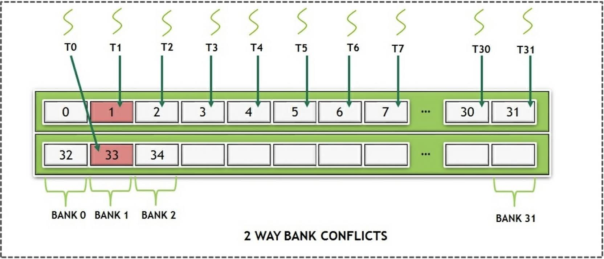
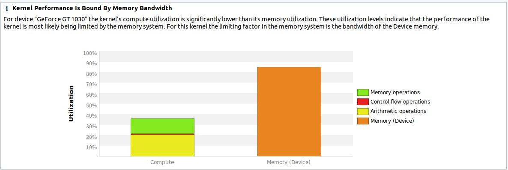

# 2.3 Shared memory
共有メモリ (Shared Memory) は **User-Managed Cache** と呼ばれ，CUDA のメモリ階層の中でも不可欠な役割を担っている．
これによって，グローバルメモリから結合的な方法でデータの読み書きをしたり，メモリに保存することができる．
共有メモリは，キャッシュのように振る舞うがユーザによって制御可能である．
本節では共有メモリの使い方だけではなく，効率的にデータのロード・ストアを行う方法や，
内部的にバンクでどのように配列されるのかについて扱う．
共有メモリは同一ブロック内のスレッドからしか見えない．
ブロック内の全てのスレッドは同じ内容の共有変数にアクセスすることになる．

共有メモリには CPU のキャッシュと同じような効用がある．
しかし，CPU のキャッシュは明示的に管理できないが，共有メモリではそれが可能である．
共有メモリはグローバルメモリよりも，1桁レイテンシが小さく，帯域幅は1桁大きい．
しかし，共有メモリの重要な使い方は，ブロック内のスレッドが同じメモリにアクセスすることにある．
カーネルの実行中，何度も繰り返し使われるデータを保持する共有変数を使うことができる．
また，同じブロック内のスレッドが結果を共有できるため，余分な計算を避けることができる．
バージョン 9.0 までの CUDA Toolkit では，異なるブロックのスレッドの間で情報の伝達を行う信頼できる仕組みがなかった．
CUDA 9.0 における情報伝達の仕組みは，後の章で詳しく扱う．
ここでは，スレッド間の情報伝達は，共有メモリを用いることでのみ可能であるとして話を進める．

## 2.3.1 Matrix transpose on shared memory
共有メモリの使い方をみるにあたって，最も簡単な例の1つとして行列の転置がある．
行列の転置はメモリに制約を受ける操作である．
次のコードはナイーブな行列転置の実装例である．

```c
__global__ void matrix_transpose_naive (int *input, int *output)
{
    int index_X = threadIdx.x + blockIdx.x * blockDim.x;
    int index_Y = threadIdx.y + blockIdx.y * blockDim.y;
    int index = index_Y * N + index_X;
    int transposed_index = index_X * N + index_Y;
    output[index] = input[transposed_index];
}
```

上記はグローバルメモリを使った行列転置のナイーブな実装である．
ナイーブな方法で実装すると，メモリアクセスが読み込むときも書き込むときも，非結合アクセスになってしまう．

次のように自分の環境をセットアップする．

1. GPU アプリケーションを準備する．([コード](./code/03_matrix_transpose/))
2. 次のようにコードをコンパイルし，プロファイリングを行う．
   ```bash
   $ nvcc -o matrix_transpose matrix_transpose.cu
   $ sudo nvprof --analysis-metrics --export-profile matrix_transpose.nvvp ./matrix_transpose
   ```
3. 出力されたプロファイルを NVIDIA Visual Profiler に読み込む．

次の図のようなプロファイルが表示される．
見てわかるように，グローバルメモリへの非結合アクセスがある．
パフォーマンスを改善するためには，この問題に取り組む必要がある．



この問題の解決策の1つは，広帯域で低遅延な共有メモリのようなメモリを使うことである．
やり方としては，グローバルメモリを結合的なアクセスで読み書きする方法がある．
ここで，共有メモリの読み書きは非結合に行うことができる．
共有メモリを使うことで，パフォーマンスを改善することができる．

```c
__global__ void matrix_transpose_shared (int *input, int *output)
{
    __shared__ int sharedMemory [BLOCK_SIZE] [BLOCK_SIZE];
    
    // 転置前のグローバルメモリ上のインデックス
    int index_X = threadIdx.x + blockIdx.x * blockDim.x;
    int index_Y = threadIdx.y + blockIdx.y * blockDim.y;

    // 転置後のグローバルメモリ上のインデックス
    int t_index_X = threadIdx.x + blockIdx.y * blockDim.x;
    int t_index_Y = threadIdx.y + blockIdx.x * blockDim.y;

    // ローカルのインデックス
    int local_index_X = threadIdx.x;
    int local_index_Y = threadIdx.y;

    int index = index_Y * N + index_X;
    int transposed_index = t_index_Y * N + t_index_X;

    // グローバルメモリから結合アクセスが可能なように共有メモリに読み出してから転置
	sharedMemory[local_index_X][local_index_Y] = input[index];

	__syncthreads();

	// 転置したデータをグローバルメモリに書き出し
	output[transposed_index] = sharedMemory[local_index_Y][local_index_X];
}
```

上記のコードは，共有メモリを用いた行列転置の実装である．
転置は共有メモリ上で行われるが，グローバルメモリの読み書きは結合的である．




## 2.3.2 Bank conflicts and its effect on shared memory
グローバルメモリを使った場合と比べて高速化できたのは，必ずしも共有メモリを効率的に使えているからではない．
このことはプロファイラの指標を見てみるとわかる．
Guided analysis から unguided analysis に切り替えると，次の画像のように共有メモリへのアクセスパターンの項目に，
アラインメントの問題が表示される．



上の画像から共有メモリの使い方が最適ではないことが分かる．
これがバンク・コンフリクト (Bank conflict) である.

このアラインメントの問題をよく理解するには，バンク (bank) の概念を理解しておくことが重要である．
共有メモリは，より広い帯域幅を確保するため，バンクにまとめられている．
各バンクは1サイクルにつき1つのアドレスに対応できる．
メモリはバンク数分だけ多くのアクセスを提供できる．
Volta GPU は32個のバンクを持ち，それぞれ4バイト幅である．
配列が共有メモリにストアされると，次の図のように，隣接する4バイトのワードが連続したバンクとなる．
共有メモリにどのようにデータが保存されているのかを示している．



同じワープ内の複数のスレッドが同時にバンクにアクセスすると，バンク・コンフリクトが生じる．
言い換えると，ワープ内で2つ以上のスレッドが同じバンクの中の別の4バイトワードにアクセスしたとき，
バンク・コンフリクトが発生するのである．
論理的には，これは同じバンクの別の行 (row) に2つ以上のスレッドがアクセスしたときに起きる．
次の図は，n 通りのバンク・コンフリクトの例である．
最悪の場合は，32通りのコンフリクトが生じ，31回のやり直しでそれぞれにつき数サイクル分の遅延が生じる．



上記のことから，同じワープ内から隣接する4バイトの要素にアクセスする場合には，異なるバンクにストアしておけば
コンフリクトは生じないことが分かる．
次の図を見てみよう．



これは，同じワープ内のスレッドから，別々のバンクの4バイトの要素にランダムにアクセスすることで，
バンク・コンフリクトを回避している．
次の図は，2通りのバンク・コンフリクトによる逐次アクセスである．



この図では，同じワープのスレッド T0 と T1 が，同じバンクの4バイトの要素にアクセスしており，
2通りのバンク・コンフリクトが発生してしまっている．

先程の行列転置の例では，パフォーマンスの改善のために共有メモリを使った．
しかし，32通りのバンク・コンフリクトが生じてしまった．
これを解決するために，パディングとして知られる簡単な手法が使える．
共有メモリにダミーのカラムを追加するだけで，スレッドがそれぞれ別のバンクにアクセスすることになり，
パフォーマンスを改善できる．

```c
__global__ void matrix_transpose_shared (int *input, int *output)
{
    __shared__ int sharedMemory [BLOCK_SIZE] [BLOCK_SIZE + 1];
    
    // 転置前のグローバルメモリ上のインデックス
    int index_X = threadIdx.x + blockIdx.x * blockDim.x;
    int index_Y = threadIdx.y + blockIdx.y * blockDim.y;

    // 転置後のグローバルメモリ上のインデックス
    int t_index_X = threadIdx.x + blockIdx.y * blockDim.x;
    int t_index_Y = threadIdx.y + blockIdx.x * blockDim.y;

    // ローカルのインデックス
    int local_index_X = threadIdx.x;
    int local_index_Y = threadIdx.y;

    int index = index_Y * N + index_X;
    int transposed_index = t_index_Y * N + t_index_X;

    // グローバルメモリから結合アクセスが可能なように共有メモリに読み出してから転置
	sharedMemory[local_index_X][local_index_Y] = input[index];

	__syncthreads();

	// 転置したデータをグローバルメモリに書き出し
	output[transposed_index] = sharedMemory[local_index_Y][local_index_X];
}
```

上記のコードでは，パディングによってバンク・コンフリクトを回避し，共有メモリの帯域幅の使用効率をあげられる．
Visual Profiler でコードの挙動を確認してみると，メモリの使用効率が上がり，
カーネルの実行時間が短縮されていることが分かる．



本節では，メモ帳のように読み書きができる共有メモリの最適な使い方を見てきた．
しかし，時には読み込むだけで書き込みアクセスは必要ない場合もある．
このような場合には，GPU は**テクスチャ (texture)** と呼ばれる，最適なメモリの使い方を提供している．
その他の長所も含め，次節でこれについて見ていこう．
次節では，読み込み専用のデータについて扱う．