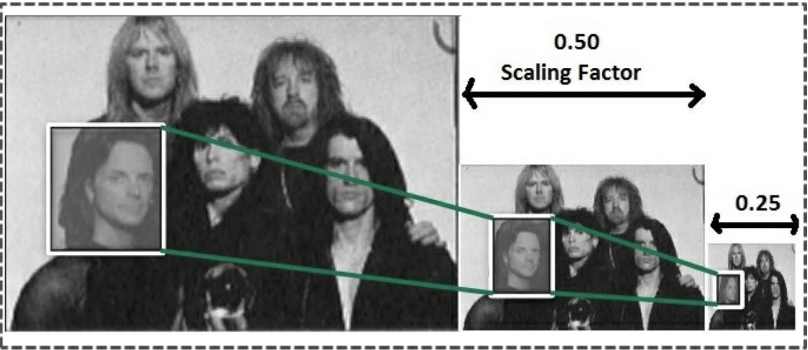

# Read-only data/cache
名前からも分かるように，リード・オンリー・キャッシュ (read-only cache) は，読み込み専用でカーネルの実行中に
変更されないデータをストアしておくのに適している．
キャッシュはこの目的に最適化されており，GPU のアーキテクチャに基づいて，ロードを無くしたり減らしたりすることで，
パフォーマンスを改善させている．
本節では，画像をリサイズするサンプルコードを用いて，リード・オンリー・キャッシュの使い方を詳しく見ていく．

読み込み専用のデータは，GPU 内のグリッドの全スレッドから見えるようになっている．
そのデータは読み込み専用として扱われ，変更を加えようとしてもカーネル内で不特定の挙動として処理される．
一方，CPU はこのデータの読み書きができる．

習慣的に，このキャッシュはテクスチャ・キャッシュ (texture cache) とも呼ばれている．
ユーザはテクスチャ API を明示的に呼び出すことで，リード・オンリー・キャッシュを使うことができるが，
最新の GPU アーキテクチャでは，CUDA のテクスチャ API を明示的に用いることなく，開発者はこのキャッシュを利用できる．
最新の CUDA と Volta のような最新の GPU では，カーネルのポインタ引数に ```const __restrict__``` で修飾することで，
リード・オンリー・キャッシュのデータパスに通されて，読み込み専用のデータになる．
開発者は ```__ldg``` によって，このキャッシュから強制的に読み出すことができる．

読み込み専用のデータは，全ワープが同じアドレスやデータを読む必要のあるアルゴリズムで使われるのが理想である．
これによってクロックサイクルあたりにデータをリクエストする全てのスレッドに，本質的にブロードキャストすることになる．
テクスチャキャッシュは2次元や3次元のデータ格納に最適化されている．
スレッドが同じワープ内にあれば，2次元や3次元のテクスチャアドレスからデータを読み込むと，
パフォーマンスが良くなる傾向がある．
テクスチャは，ランダムにメモリにアクセスする必要があるアプリケーションに有用であることがわかっており，
特に Volta より先のアーキテクチャではより顕著になる．

テクスチャは，バイリニア補間やトリリニア補間をサポートしており，
画像のスケーリングなど，画像処理のアルゴリズムで特に有用である．
次の図は，同じワープ内のスレッドが2次元構造を持つ要素にアクセスする例を表している．
テクスチャはこのような作業に適している．
それでは，テクスチャメモリの使い方を，スケーリングの簡単な実世界アルゴリズムを通してみていこう．


## 2.4.1 Computer vision - image scaling using texture memory
ここでは，画像のスケーリングを例に，テクスチャメモリの使い方を見ていく．
画像のスケーリングは次のようなタスクである．



画像のスケーリングでは，2次元の画像ピクセルの補間が必要となる．
もし，直接グローバルメモリにアクセスしようとすると，メモリへのアクセスが隠蔽できなくなってしまう，
いずれの機能(補間と2次元配置に対する効率的なアクセス)もテクスチャメモリは持っている．

次の手順で環境設定を行う．

1. GPU アプリケーションの用意([コード](code/04_image_scaling/image_scaling.cu))
2. 次の順番でコンパイルする．
   ```bash
   $ nvcc -c scrImagePgmPpmPackage.cpp
   $ nvcc -c image_scaling.cu
   $ nvcc -o image_scaling image_scaling.o scrImagePgmPpmPackage.o
   ```

[```scrImagePgmPpmPackage.cpp```](code/04_image_scaling/scrImagePgmPpmPackage.cpp) は 
PGM 形式の画像を読み書きするためのソースコードで，スケーリングの本体は
[```image_scaling.cu```](code/04_image_scaling/image_scaling.cu) のほうである．

初めに，テクスチャメモリを利用するためには，次の4つのステップが必要となる．

1. テクスチャメモリの宣言
2. テクスチャメモリをテクスチャ参照 (texture reference) にバインド
3. CUDA カーネルのテクスチャ参照を使ってテクスチャメモリを読み込む
4. テクスチャメモリとテクスチャ参照のバインドを解除

以下に，テクスチャメモリを利用するためのコードを示す．
Kepler GPU アーキテクチャ以降で CUDA 5.0 よりも新しいバージョンであれば，
バインドレス・テクスチャ (bindless texture) が使える．
これによって，テクスチャ・オブジェクト (texture object) が使えるようになる．
これは，基本的には CUDA カーネルで実行可能な C++ オブジェクトである．
バインドレス という名前からも分かるように，以前のバージョンの GPU や CUDA では必要だった，
ユーザによるバインドやアンバインドが不要である．
テクスチャオブジェクトは ```cudaTextureObject_t``` クラス API を用いて宣言する．

1. 最初にテクスチャメモリを宣言する
   ```c
   texture<unsigned char, 2, cudaReadModeElementType> tex;
   ```
   テクスチャとリンクしている間に使われる，チャネルディスクリプション (Channel Description) を生成する．
   ```c
   cudaArray* cu_array;
   cudaChannelFormatKind kind = cudaChannelFormatKindUnsigned;
   cudaChannelFormatDesc channelDesc = cudaCreateChannelDesc(8, 0, 0, 0, kind);
   ```
2. 続いてテクスチャオブジェクトのパラメータを特定する
   ```c
   struct cudaTextureDesc texDesc;
   // メモリにゼロをセットする
   memset(&texDesc, 0, sizeof(texDesc));
   // x 方向の次元のアドレスモードを Clamp に設定
   texDesc.addressMode[0] = cudaAddressModeClamp;
   // y 方向の次元のアドレスモードを Clamp に設定
   texDesc.addressMode[1] = cudaAddressModeClamp;
   // フィルタモードを Point に設定
   texDesc.filterMode = cudaFilterModePoint;
   // 要素のタイプを読込み，補間はしない
   texDesc.readMode = cudaReadModeElementType;
   texDesc.normalizedCoords = 0;
   ```
3. 次に CUDA カーネルのテクスチャ参照からテクスチャメモリを読み込む
   ```c
   imageScaledData[index] = tex2D<unsigned char>(texObj, (float)(tidX * scale_factor), (float)(tidY * scale_factor));
   ```
4. 最後にテクスチャオブジェクトを破棄する
   ```c
   cudaDestroyTextureObject(texObj);
   ```

ここで，コンフィグレーションのように動作したり，開発者によって設定される，テクスチャメモリの要点は次の通り．

### Texture dimension
テクスチャが1次元，2次元，3次元のいずれの配列としてアドレスが指定されるのかを定義する．
テクスチャ内の要素は，テクセル (texel) として参照される．
また，各次元は深さ (depth)，幅 (width)，高さ (height)として設定される．
GPU のアーキテクチャによって，許容できる各次元の最大サイズは異なる．

### Texture type
テクセルがベーシックな整数型か浮動小数点数型のいずれであるかを指定する．

### Texture read mode
テクスチャの読み込みモードは，要素の読み込み方法を指定する．
```NormalizedFloat``` または ```ModelElement``` のいずれかの形式で読み込める．
Normalized Float モードではインデックスが，unsigned int 型の場合には [0.0, 1.0]，signed int 型の場合には [-1.0, 1.0]
の範囲になければならない．

### Texture addressing mode
テクスチャに特有の機能の一つは，範囲外のアクセスにアドレスを割り当てられる方法である．
これはおかしな気もするが，実際に多くの画像処理アルゴリズムでは非常によく使われる．
例えば，隣接ピクセルの平均値で補間を行う場合，協会のピクセルはどう処理すべきであろうか？
このような場合に，範囲外の領域を clamp，wrap，mirror のいずれかを選択できるようになっている．
画像リサイズの例では，clamp モードに設定している．
これで基本的に範囲外へのアクセスは境界に固定される．

### Texture filtering mode
テクスチャをフェッチした際に返り血を計算する方法を指定する．
```cudaFilterModePoint``` と ```cudaFilterModeLinear``` の2種類から選べる．
Linear モードでは補間が効く(1次元ならシンプルリニア，2次元ならバイリニア，3次元ならトリリニア補間)．
Linear モードは返り値の型が float の場合にのみ機能する．
一方，Point モードでは補間は行わず，最も近い座標のテクセルが返される．

本節では，例を用いてテクスチャメモリを使う目的を見てきた．
次節では，最も高速な(低遅延な) GPU メモリであるレジスタについて見ていく．
レジスタは CPU に比べて GPU に多く積まれている．