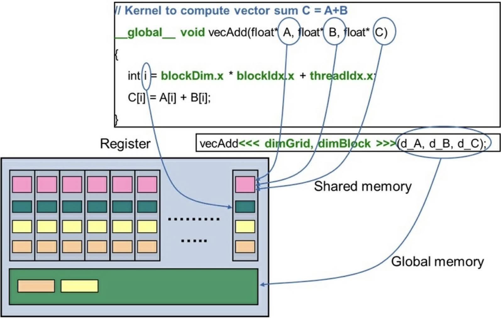

# 2.5 Register in GPU
CPU と GPU のアーキテクチャの大きな違いの1つは，GPU の方が多くのレジスタが実装されていることである．
これによって，スレッドが必要なデータのほとんどをレジスタに保持できるため，
コンテキストスイッチによるレイテンシを軽減できる．
したがって，このメモリをうまく使いこなすことも重要となってくる．

レジスタのスコープは単一のスレッドである．
変数のプライベートなコピーがグリッド内の立ち上げられている全てのスレッドに作成される．
他のスレッドのプライベート変数にはアクセスできないが，各スレッドは変数のコピーにアクセスできる．
例えば，1000スレッドのカーネルが立ち上げられたとき，あるスレッドをスコープとする変数は自身のコピーが作られる．

カーネルの一部として宣言されるローカル変数はレジスタに保存される．
中間変数もレジスタに保存される．
全てのレジスタは，それぞれ固定サイズのレジスタを持つ．
コンパイル中，コンパイラ (nvcc) はスレッドあたりの適切なレジスタ数を探索する．
CUDA のカーネルサイズが大きいときや，ローカル変数や中間の計算が多いときによく起こるが，レジスタ数が不足する場合には，
L1/L2 キャッシュや，グローバルメモリのような更に低階層のメモリなどのローカルメモリにプッシュされる．
これもレジスタから溢れたものとして扱われる．
スレッドあたりのレジスタ数は，SM 上のアクティブ化可能なブロックやスレッドの数を決定するのに重要な役割を担う．
この内容は，占有率 (occupancy) について扱う節のある，次の章で詳しく見ていく．
一般的に，不必要に多くのローカル変数を定義しないことが推奨されている．
レジスタによって SM 上でスケジューリング可能なスレッド数が制限されるようであれば，
カーネルを2つ，もしくは可能ならばそれより多くのカーネルに分割し，コードを再構築する必要がある．

```vecAdd``` カーネルの一部として宣言された変数は，レジスタメモリに保持される．
カーネルに渡される引数，A と B，C はグローバルメモリを指しているが，変数自体は GPU のアーキテクチャに基づいて
レジスタの共有メモリにも保持されている．
次の図は，CUDA メモリの階層構造と，様々な種類の異なる変数がデフォルトで格納される場所を表している．



ここまで，主要なメモリの階層(グローバル，テクスチャ，共有，レジスタ)の目的と最適な使い方を見てきた．
次節では，アプリケーションのパフォーマンスを改善したり，CUDA プログラミングの生産性を向上させたりできる
最適化や GPU メモリの特性について見ていく．