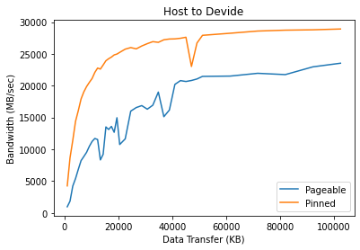
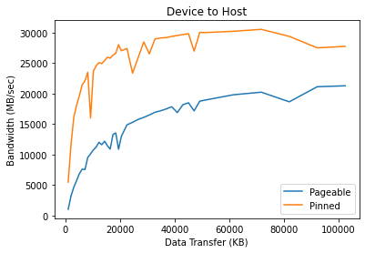

# 2.6 Pinned memory
データの通る経路を思い出してみよう．
CPU メモリから GPU レジスタを経て，最終的にはGPU のコアで計算に使われる．
GPU がより高い計算能力を持ち，より広帯域なメモリを搭載していたとしても，アプリケーションによって得られる
高速化の恩恵は，CPU メモリと GPU メモリの間の伝達のために，標準化されてしまう．
このようなデータの伝達は，(Intel や AMD のアーキテクチャを採用した CPU であれば) PCIe であったり，
(OpenPower Foundation の power のようなCPUアーキテクチャであれば) NVLink といったような，
バスやリンク，プロトコルによって行われる．

このボトルネックを解決するために，次のようなトリックやガイドラインが推奨されている．

- 初めに，ホストとデバイスでやり取りするデータ量を，可能ならば極力少なくすることが推奨されている．
  これは，ホスト CPU で逐次的に実行したときと比べて，ほとんど，あるいは全く高速化されないような時にも，
  カーネルの一部として逐次処理的なコードの一部を GPU 上で実行することまで意味している．
- 次に，ピンメモリ (Pinned memory) を使って，ホストとデバイスの間でより広い帯域幅を実現することが重要である．
- いくつかの小さなデータのやり取りを，1つにまとめることが推奨されている．
  これによって，システム構成によっては数マイクロ秒から数ミリ秒にもなる データ伝達の CUDA API の呼び出し周りの
  遅延を軽減できる．
- 最後に，アプリケーションでは，カーネル実行とデータ伝送を同時に行うため，非同期的なデータ伝送を用いることができる．

本節では，ピンメモリの伝送について更に詳しく見ていく．
非同期的な伝送は CUDA stream と呼ばれる概念を扱った第4章で詳しく説明する．

## 2.6.1 Bandwidth test - pinned versus pageable
デフォルトで，```malloc()``` と呼ばれるメモリ割当を行う API はページング可能な形でメモリの割当を行う．
これは，必要であればページとしてマッピングされたメモリが，他のアプリケーションや OS 自体によって
スワップアウト可能であることを意味する．
したがって，GPU や PCIe バスにもあるインフィニバンド (InfiniBand) のようなデバイスのほとんどは，
伝達の前にメモリが固定されていることを想定している．
デフォルトで，GPU はページング可能なメモリにアクセスしない．
そのため，メモリの伝達が始まると，CUDA ドライバは一時的なピンメモリを割り当て，デフォルトの Pageable メモリから
データをコピーして，**Device Memory Controller (DMA)** を介してデバイスにデータを送る．

この追加のステップによって，遅延が増大するだけでなく，GPU メモリに送るように求められたページを得る可能性がある．
そのページがスワップされると，GPU メモリに戻す必要がある．

ピンメモリの影響を理解するため，サンプルコードを見てみよう．
このコードは CUDA のサンプルコードとして提供されている．
次のように環境設定を行う．

1. [サンプルコード](../cuda-sample/1_Utilities/bandwidthTest/bandwidthTest.cu)を用意する．
2. ```make``` する．
3. 次のように2つのモードで実行する．
   ```bash
   $ ./bandwidthTest --mode=shmoo --csv --memory=pageable > pageable.csv
   $ ./bandwidthTest --mode=shmoo --csv --memory=pinned > pinned.csv
   ```

コードを見て分かるように，これまで扱ってきたコードと比較した場合の重要な変更は，データ割当を行う API である．
次のコードスニペットは，```malloc``` の代わりに ```cudaMallocHost``` API を使ってメモリ割り当てを行っている．

```c
cudaError_t status = cudaMallocHost((void **)&h_aPinned, bytes);
if (status != cudaSuccess)
    printf("Error allocationg pinned host memory\n");
```

```cudaMallocHost``` API はメモリとして，Pageable メモリの代わりにピンメモリを使う．
割当を行う API が変わっても，同じデータ移動 API (```cudaMemcpy```) を使うことができる．
ここで，「ピンメモリとは何者で，なぜより広い帯域幅が得られるのか」とい疑問が湧いてくる．
これについては次節で見ていこう．

帯域テストの出力から，パフォーマンスへの影響が見て取れる．
見やすいようにグラフにプロットしたのが次の図である．
$x$ 軸が KB 単位でのデータ転送量，$y$ 軸が帯域幅 MB/sec を表している．




左側がホストからデバイスへの送信，右側がデバイスからホストへの送信である．
最大で 30GB/sec ほどの帯域幅が得られている．
達成可能な帯域幅は，マザーボードや CPU，PCIe のトポロジーなどシステム構成に大きく依存する．

グラフから分かるように，ピンメモリについて，転送量が少ない場合で特に広帯域を実現している．
オーバラップ (overlapping) などの概念を適用することで，ドライバや DMA エンジンによる最適化がかかるようになるため，
転送量が大きくなると Pageable メモリとの差が狭まっていく．
ピンメモリの使用が推奨されているのと同様，あまりやりすぎるとマイナスに働くこともある．
アプリケーションについて全システムのメモリをピンメモリとして割り当てると，
全体のパフォーマンスが下がってしまうことがある．
これは，他のアプリケーションや OS のタスクで使えるページがなくなってしまうために生じる．
丁度いいピンメモリのサイズはアプリケーションやシステムに大きく依存しており，
これについて既定の解決策はない．
最善の策は，利用しているシステムでアプリケーションのテストをして，パフォーマンスの最も良いパラメータを探すことだ．

また，データ転送によって制約を受けるアプリケーションについて，NVLinｋのような新しい内部接続によって，
より広い帯域と低い遅延を得られることを理解しておくことも重要である．
CPU と GPU の間の NVLink は PowerCPU でのみ利用可能である．

本節では，CPU と GPU の間でデータ転送を高速化する方法を見てきた．
続いて，ユニファイドメモリ (Unified Memory) と呼ばれる，CUDA の新機能の使い方を見ていこう．
これを使うことで，CUDA プログラミングの生産性を向上させることができる．