# 2.7 Unified memory
新しい CUDA や GPU アーキテクチャが発表されるたび，新しい機能が追加されていく．
この新機能によって，パフォーマンスを高めたりプログラミングしやすくしたりすることができ，
あるいは，CUDA を使って GPU ではできなかったようなアルゴリズムを実装できるようになったりする．
そうした重要な新機能の1つが，CUDA 6.0 以降でサポートされ，Kepler 世代から実装されるようになった
ユニファイドメモリ (Unified Memory) である．
ここでは，ユニファイドメモリは UM として表す．

簡単に言うと，UM はシステム内の全ての CPU と GPU からアクセス可能な単一のメモリ空間として扱うことができる．
ちょうど次の図のようになる．

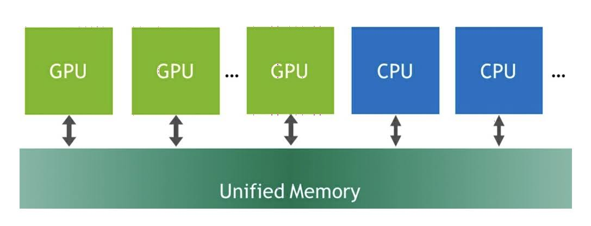

本節では，UM の使い方と最適化の方法を扱い，これを使うことの重要なアドバンテージを見ていく．
非結合的なアクセスがなされると，パフォーマンスが低下するグローバルメモリのアクセスと同じように，
UM も正しく使わないと，アプリケーション全体のパフォーマンスが低下してしまう．
UM とパフォーマンスへの影響を理解するため，簡単なプログラムから始めて，少しずつコードを組み上げていこう．

それではサンプルプログラムをコンパイルして実行してみよう．

1. GPU アプリケーションを用意する ([コード](code/07_unified_memory/))
2. 次のようにコンパイルする
   ```bash
   $ nvcc -o unified_simple.out unified_memory.cu
   $ nvcc -o unified_initialized.out unified_memory_initialized.cu
   $ nvcc -o unified_prefetch.out unified_memory_prefetch.cu
   $ nvcc -o unified_64align.out unified_memory_64align.cu
   ```

ちなみに，本節で示す結果は GPU の世代によって大きく異なる．


## 2.7.1 Understanding unified memory page allocation and transfer
では，UM のナイーブな実装から見ていこう．
```unified_memory.cu``` は基本的な UM の使い方を示している．
重要な変更点は次に示すように，メモリ割当に ```malloc``` ではなく ```cudaMallocManaged``` API を使っている点である．

```cpp
int N = 1 << 20;
float *x, *y;

// Unified memory の割当 (CPU と GPU からアクセス可能)
cudaMallocManaged(&x, N * sizeof(float));
cudaMallocManaged(&y, N * sizeof(float));

// ホスト側で配列を初期化
for (int i = 0; i < N; i++) {
    x[i] = 1.0f;
    y[i] = 2.0f;
}

...

add<<<numBlocks, blockSize>>>(N, x, y);
```

注意深くソースコードを見てみると，変数 $x$，$y$ が UM を指すように1度だけ割り当てられていることが分かる．
同じポインタが GPU の ```add``` カーネルでも，CPU の初期化ループでも使われている．
これによって，ポインタが CPU メモリと GPU メモリのどちらを指すのか追跡せずに済むため，プログラミングが簡単になる．
しかし，これによって必ずパフォーマンスの改善や，転送速度の向上が見られるのだろうか？
答えは，必ずしもそうとは限らない．
では，プロファイラでこのコードを掘り下げてみていこう．
プロファイリングを実行すると，次のような結果が表示される．

```bash
$ nvprof ./unified_simple.out
```

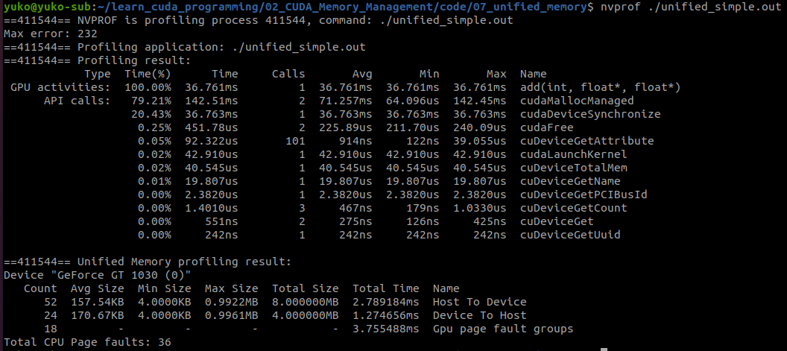

予想通り実行時間のほとんどが ```add``` カーネルに占有されている．
理論的に帯域幅を計算してみよう．
帯域幅は次のように計算できる．

$$
Bandwidth = \frac{Bytes}{Seconds} 
= \frac{(1 << 20) \times 4 Bytes \times 3 \times 10^{-9}}{36.761 \times 10^{-3}s} = 0.34 GB/s
$$

このように，GT1030 の理論的な帯域幅は 48.06 GB/s であるにもかかわらず，わずか 0.34 GB/s しか出ていない．
なぜ帯域幅の計算しかしないのかと疑問に思うかも知れない．
これは，今回扱ったアプリケーションが，3回のメモリ操作と1回の加算処理から構成されており，
メモリに制約を受けるからである．
そのため，メモリ帯域にのみ注目している．

Pascal 世代以降では，```cudaMallocManaged()``` は物理メモリを割り当てるのではなく，
最初にアクセスされたものからメモリが割り当てられるようになっている．
変数が最初に GPU にアクセスされると，GPU 上でページが割り当てられ，ページテーブルにマッピングされる．
逆に，CPU から最初にアクセスされると，CPU 側で割当とマッピングが行われる．
今回のコードでは，最初に $x$ と $y$ は CPU で初期化される．
そのため，CPU 上にページが割り当てられる．
```add``` カーネルでは，これらの変数にアクセスすると，ページフォルトが発生し，ページマイグレーションの時間が
カーネルの実行に加わることになる．
これが，カーネルの実行時間が長くなる根本的な理由である．

次のような流れでページマイグレーションが完了される．

1. 最初に，(最初にアクセスされたものから) GPU や CPU で新しくページを割り当てる必要がある．
   ページが存在せず，CPU側にマッピングされていた場合には，デバイス側のページテーブルでページフォルトが生じる．
   CPU メモリ上にマッピングされている page 2 を指している *$x$ が，GPU 上でアクセスされた時，ページフォルトが起きる．

   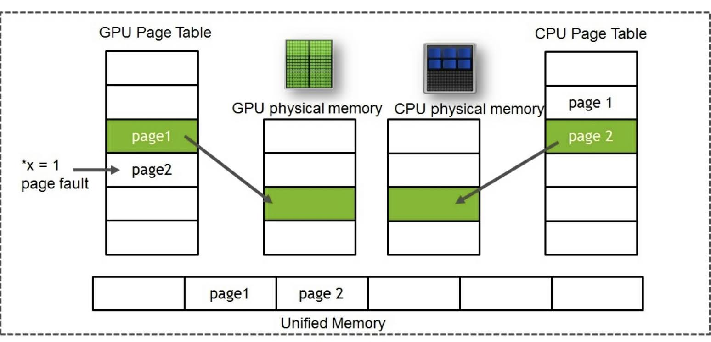

1. CPU 上の古いページのマッピングを削除する．
   
   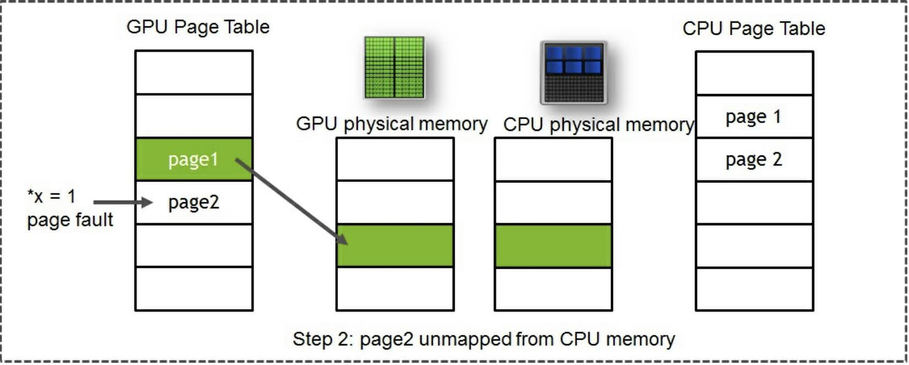

1. CPU から GPU にデータをコピーする．

   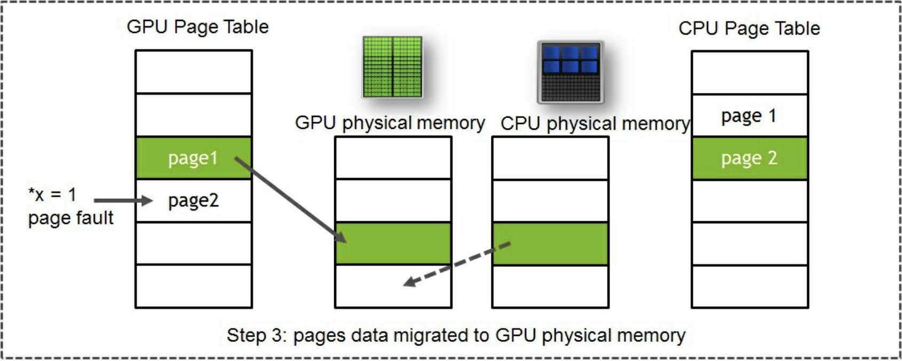

1. 最後に，CPU 上の古いページが解放され，GPU 上に新しいページがマッピングされる．

   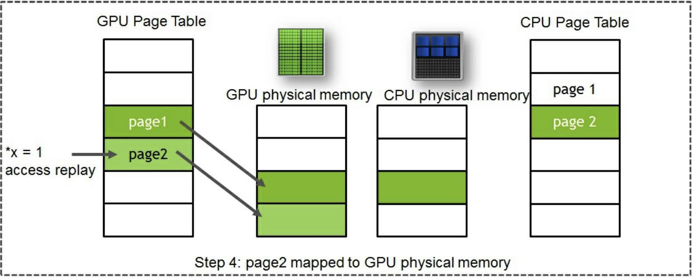

CPU と同様，GPU の **Translation Lookaside Buffer (TLB)** は物理アドレスから仮想アドレスへのアドレス変換を行う．
ページフォルトが起こると，それぞれの SM の TLB がロックされる．
基本的に，先行するステップが実行され，最終的に TLB のロックが解除されるまで，新しい命令の実行が止まる．
このような動作は，一貫性を維持し，SM 内のメモリの状態が一致するようにするために必要である．
ドライバは重複の除去やマッピングの更新，ページデータの転送を担っている．
先程も述べたように，これらの時間は全てカーネルの実行時間に加わることになる．

そこで問題が生じる．
どうやって解決すれば良いのだろうか？
解決策には2つのアプローチがある．

- ```add``` カーネルの実行中にページフォルトが生じないように，GPU 側に初期化を行うカーネルを作成する．
  すると，ページごとのワープを用いることでページフォルトが最適化される．
- データをプリフェッチする．

次節でこれらの内容について見ていこう．


## 2.7.2 Optimizing unified memory with worp per page
それでは，1つ目の解決策を見ていこう．
それは，初期化カーネルである．
[```unified_memory_initialized.cu```](code/07_unified_memory/unified_memory_initialized.cu) を見てみると，
次のような ```init``` カーネルが追加されている．

```c
__global__ void init(int n, float *x, float *y) {
    int index = threadIdx.x + blockIdx.x * blockDim.x;
    int stride = blockDim.x * gridDim.x;
    for (int i = index; i < n; i += stride) {
        x[i] = 1.0f;
        y[i] = 2.0f;
    }
}
```

GPU 側で配列の初期化を行うカーネルを追加することで，```init``` カーネルで最初にアクセスしたときに，
GPU メモリにページが割り当てられマッピングされる．
プロファイリングの結果は次のようになる．

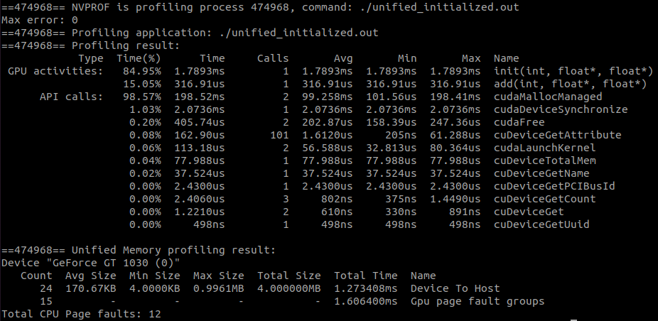

```add``` カーネルの実行時間が317マイクロ秒まで短縮されている．
ここから，カーネルの帯域幅を計算すると次のようになる．

$$
Bandwidth = \frac{Bytes}{Seconds} 
= \frac{(1 << 20) \times 4 Bytes \times 3 \times 10^{-9}}{316.9 \times 10^{-6}s} = 39.7 GB/s
$$

この帯域幅は，ユニファイドメモリを使わなかった場合に期待されるものである．
ナイーブな実装の結果から見た時，Host to Device の行がないことが分かる．
しかし，```add``` カーネルの実行時間は短縮されているが，
```init``` カーネルは最大時間を取るホットスポットにはなっていない．
これは，```init``` カーネルで最初にメモリにアクセスされるからである．
また，GPU page fault groups が何なのか疑問に思うかも知れない．
これまでにも議論したように，アクセスパターンと同様に，各ページフォルトはヒューリスティクスに基づいて
帯域幅が改善するようなグループにまとめられる．
より詳しく知るために ```--print-gpu-trace``` オプションを付けてプロファイリングを実行してみよう．
次の画像のように，全てのページフォルトの追跡結果と，ページフォルトの起きた仮想アドレスが表示される．

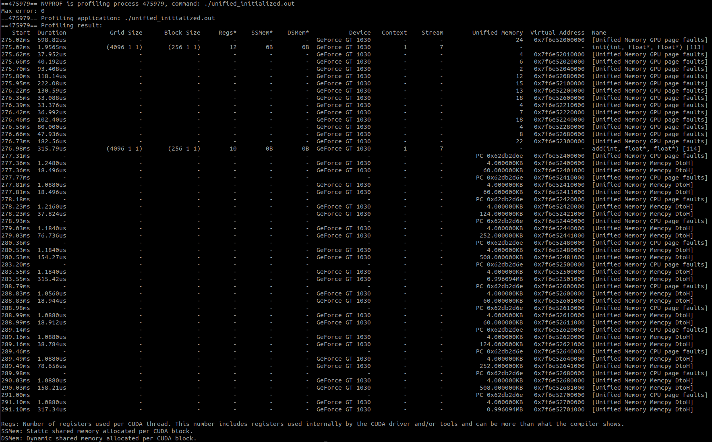

Unified Memory の列の1行目をみると，同じページにつき24個のページフォルトが起きていることが分かる．
これまでも議論したように，ドライバの役割は，このような重複したページフォルトをフィルタリングし，
各ページの転送を1度だけ行うことである．
複雑なアクセスパターンでは，一般的に，ドライバは GPU にどのデータが転送できるのかについての情報が不足している．
これを改善するために，さらに warp per page の概念を実装する．
これは，基本的に書くサーぷは同じページの要素にアクセスするということである．
この実装には更に手間がかかる．
```init``` カーネルを再度実装してみよう．
実装は [```unified_memory_64align.cu```](code/07_unified_memory/unified_memory_64align.cu) を参照してほしい．
初期化カーネルは次のようになっている．

```c
__global__ void init(int n, float *x, float *y) {
    int lane_id = threadIdx.x & 31;
    size_t warp_id = (threadIdx.x + blockIdx.x * blockDim.x) >> 5;
    size_t warps_per_grid = (blockDim.x * gridDim.x) >> 5;
    size_t warp_total = ((sizeof(float)*n) + STRIDE_64K-1) / STRIDE_64K;

    for( ; warp_id < warp_total; warp_id += warps_per_grid) {
        #pragma unroll
        for(int rep = 0; rep < STRIDE_64K/sizeof(float)/32; rep++) {
            size_t ind = warp_id * STRIDE_64K/sizeof(float) + rep * 32 + lane_id;
            if (ind < n) {
              x[ind] = 1.0f;
              y[ind] = 2.0f;
            }
        }
    }
}
```

インデックシングが ```warp_id``` を基に行っていることが分かる．
GPU のワープサイズは32で，64KBのレンジを持つインデックスの中で，$x$ と $y$ の書き込みを行っている．
つまり，ワープ1は最初の64KBを，ワープ2が次の64KBの要素を，というように分担しているのである．
ワープループ(1番内側の for ループ)内のスレッドは，同じ64KBの中のインデックスに書き込まれる．
これでプロファイリングを実行してみると，次の画像のように，```init``` カーネルの実行時間が短縮され，
GPU のページフォルトが大きく減少していることが分かる．

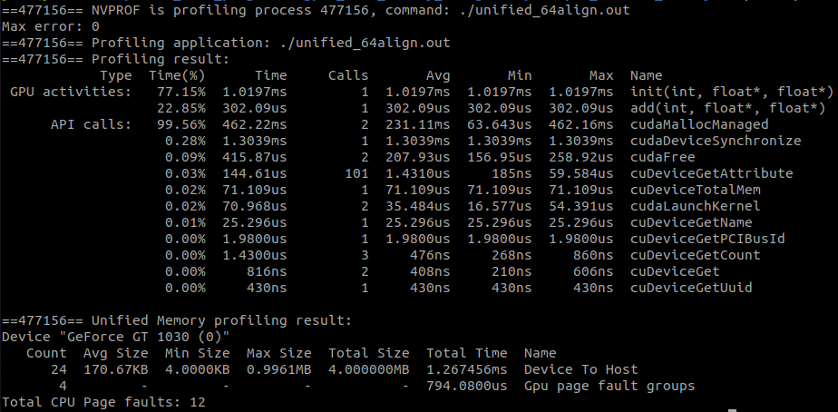

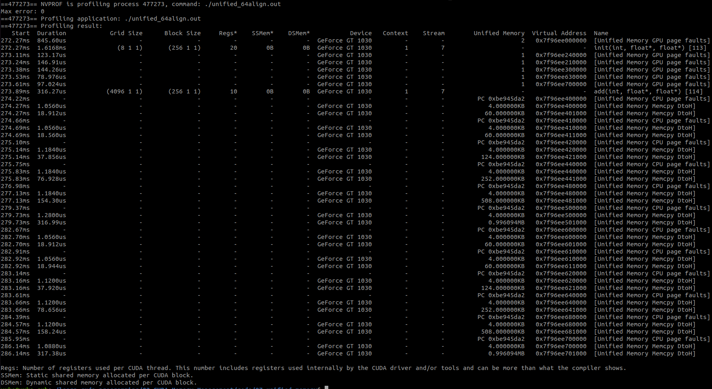


## 2.7.3 Optimizing unified memory with data prefetching
データプリフェッチング (data prefetching) と呼ばれるより簡単な方法を見てみよう．
CUDA で重要なことの1つに，簡単な方法から，忍者のような高度なプログラミングスキルが必要な方法まで，
様々な実装方法が用意されていることである．
**Data prefetching** は基本的に，ドライバに対してデバイスで使われると思われるデータを，
使われるのに先立って予めフェッチさせる．
このために，CUDA はプリフェッチを行う API ```cudaMemPrefetchAsync()``` を提供している．
実装は，[```unified_memory_prefetch.cu```](code/07_unified_memory/unified_memory_prefetch.cu) を参照．
プリフェッチを行っているのは次の箇所である．

```c
// Unified memory の割当 (CPU と GPU からアクセス可能)
cudaMallocManaged(&x, N*sizeof(float));
cudaMallocManaged(&y, N*sizeof(float));
// ホスト側で配列を初期化
for (int i = 0; i < N; i++) {
    x[i] = 1.0f;
    y[i] = 2.0f;
}
// GPU が unified memory のメモリをプリフェッチする
cudaGetDevice(&device);
cudaMemPrefetchAsync(x, N*sizeof(float), device, NULL);
cudaMemPrefetchAsync(y, N*sizeof(float), device, NULL);
...

add<<<numBlocks, blockSize>>>(N, x, y);
// ホストがメモリをプリフェッチする
cudaMemPrefetchAsync(y, N*sizeof(float), cudaCpuDeviceId, NULL);
// カーネルの実行が終わるまで待つ
cudaDeviceSynchronize();
...

for (int i = 0; i < N; i++)
    maxError = fmax(maxError, fabs(y[i]-3.0f));
```

コードはとてもシンプルで，説明しなくてもわかってもらえるだろう．
コンセプトはとてもシンプルで，あるデバイスでどのメモリが使われるか分かっている場合には，
メモリをプリフェッチすることができる．
これでプロファイリングを実行すると，```add``` カーネルで期待通りの帯域幅が得られていることが分かる．

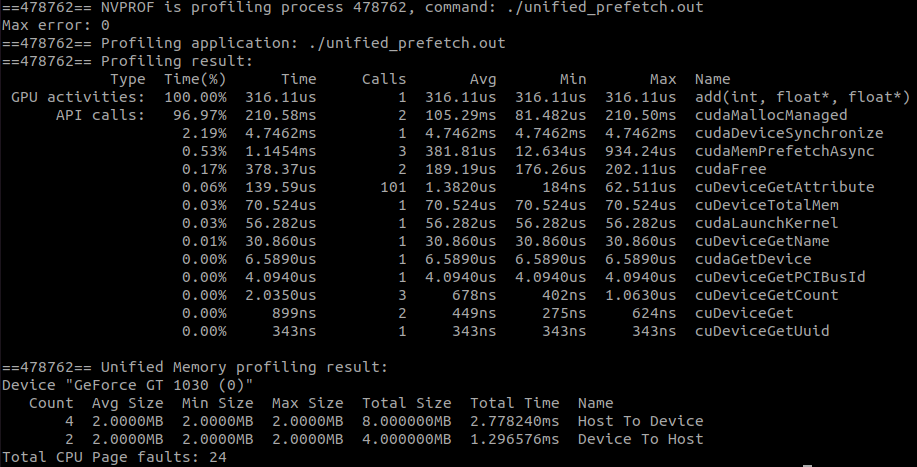

ユニファイドメモリは発展途上の機能で，CUDA のバージョンや GPU アーキテクチャごとに変更がある．
[CUDA プログラミングガイド](https://docs.nvidia.com/cuda/cuda-c-programming-guide/index.html#um-unified-memory-programming-hd)で最新の情報にキャッチアップしておくとよいだろう．

ここまで，CUDA API を明示的に使ってメモリ管理をしなくても簡単にプログラミングできるだけでなく，
UM を使わないとアプリケーションを GPU 側に持ってこられない場合や，持ち込むのが非常に難しい場合などに，
強力で便利なツールとなる UM の有用性を見てきた．
UM を使うアドバンテージの1つは，加入過多 (over-subscription) である．
GPU メモリは CPU メモリに比べて非常に容量が限られている．
最新の Volta V100 で1台あたり最大32GBである．
UM を使うことで，CPU メモリに加えて複数の GPU メモリを1つの大きなメモリとして扱うことができる．
例えば，NVIDIA DGX2 では，Volta GPU 16台と323GBのメモリが搭載され，GPU をメモリをまとめて最大で512GBとして扱える．
このアドバンテージは，**Computational Fluid Dynamics (CFD)** や解析では特に大きい．
以前は GPU メモリのサイズに問題を収めるのが難しかった問題を，解くことができるようになる．
これを手作業で行うとエラーが起こりやすく，メモリサイズのチューニングが必要となる．

また，NVLink や NVSwitch のような高速な内部接続が登場したことで，高帯域幅で低遅延の GPU 間の高速データ転送が
可能となった．
ユニファイドメモリを使ってハイパフォーマンスなアプリケーションを作れるようになったのである．

データが実際にどこにあるのかを特定するヒントと組み合わせたデータのプリフェッチは，
複数のプロセッサが同時に同じデータにアクセスする必要があるような場合に便利である．
このような場合に使われる API は ```cudaMemAdvice()``` である．
したがって，アプリケーションをひっくり返して知ることによって，このような手がかりを使ってアクセスを最適化できる．
また，ドライバのヒューリスティクスを乗り越えるのにも有用である．
API ごとに次のようなアドバイスがなされている．

- cudaMemAdviseSetReadMostly()  
  データがほとんど読み込み専用であることを示している．
  ドライバは読み込み専用のデータのコピーを作成し，ページフォルトの発生を減らせる．
  データに書き込むことも可能であることには注意が必要である．
  そのような場合には，メモリに書き込んだデバイス以外，ページが無効化される．

  ```c
  // GPU から見てデータを読み込み専用に設定
  cudaMemAdvise(data, N, ..SetReadMostly, processorId);
  mykernel<<<..., s>>>(data, N);
  ```

- cudaMemAdviseSetPrefferedLocation  
  データの好ましいロケーションをデバイスに属するメモリに設定する．
  好ましいロケーションを設定しても，すぐにデータがそのロケーションに移されるわけではない．
  次のコードのように，```mykernel``` がページフォルトを起こし，CPU 上のデータへのダイレクトマッピングが生成される．
  ドライバは ```cudaMemAdvise``` を使って，設定された好ましいロケーションから離れた場所にデータが移されることを
  妨げようとする．

  ```c
  cudaMemAdvise(input, N, ..PrefferedLocation, processorId);
  mykernel<<<..., s>>>(input, N);
  ```

- cudaMemAdviseSetAccessedBy  
  データがデバイスによってアクセスされることを示す．
  デバイスは CPU メモリにある入力のダイレクトマッピングを作成し，ページフォルトは発生しない．

  ```c
  cudaMemAdvise(input, N, ..SetAccessedBy, processorId);
  mykernel<<<..., s>>>(input, N);
  ```

次節では，様々な GPU のメモリがアーキテクチャが新しくなるごとにどう進化してきたのかを俯瞰する．