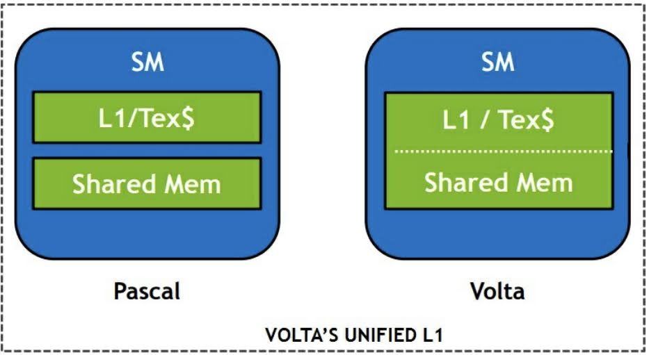

# 2.8 GPU memory evolution
GPU アーキテクチャは進化を続け，メモリアーキテクチャは大きな変化を遂げてきた．
最近の4世代を見た時，次のような決まったパターンが見られる．

- 各階層のメモリ容量が概して増加している
- アーキテクチャが新しくなるごとに，メモリの容量と帯域幅が増加している

最近4世代の特徴は次のようになっている．

| Memory type | Properties | Volta V100 | Pascal P100 | Maxwell M60 | Kepler K80 |
| :---: | :---: | :---: | :---: | :---: | :---: |
| Register | Size per SM | 256KB | 256KB | 256KB | 256KB |
| L1 | Size | 32...128 KiB | 24 KiB | 24 KiB | 16...48 KiB |
| L1 | Line size | 32 B | 32 B | 32 B | 128 B |
| L2 | Size | 6,144 KiB | 4,096 KiB | 2,048 KiB | 1,536 KiB |
| L2 | Line size | 64 B | 32 B | 32 B | 32 B |
| Shared memory | Size per SMX | Up to 96 KiB | 64KiB | 64KiB | 48KiB |
| Shared memory | Size per GPU | Up to 7,689 KiB | 3,584 KiB | 1,536 KiB | 624 KiB |
| Shared memory | Theoritical bandwidth | 13,800 GiB/s | 9,519 GiB/s | 2,410 GiB/s | 2,912 GiB/s |
| Global memory | Memory bus | HBM2 | HBM2 | GDDR5 | GDDR5 |
| Global memory | Size | 32,152 MiB | 16,276 MiB | 8,155 MiB | 12,237 MiB |
| Global memory | Theoritical bandwidth | 900 GiB/s | 732 GiB/s | 160 GiB/s | 240 GiB/s |

一般的に，新しいアーキテクチャで CUDA アプリケーションを高速化するのに，それまでの知識が役立つことが多い．
しかし，同時に CUDA プログラミングを簡単にできるよう，メモリアーキテクチャの更新のような，
CUDA プログラミングモデルが根本的に変化することもある．
その例としてテクスチャメモリがあり，CUDA 5.0 以前ではテクスチャのバインドとアンバインドを手動で行い，
グローバルに宣言しなければならなかった．
CUDA 5.0 では，その必要が無くなった．
アプリケーション内でのテクスチャ数の制限も撤廃された．

Volta アーキテクチャでも，シンプルにプログラミングができるように，根本的な変更が加えられている．
Volta の合計容量は 128KB/SM で，これは前世代 Pascal P100 の7倍も多く，より多くのキャッシュを使うことができる．
また，Volta アーキテクチャでは，統一によって L1 キャッシュのレイテンシが大幅に軽減され，
繰り返し使われるデータへ，広帯域・低遅延でアクセスできるようになった．
このようにした重要な理由は，L1 キャッシュの操作で共有メモリのパフォーマンスを改善させるためである．
共有メモリは明示的に開発者側で調整してやる必要があることが大きな問題であった．
これによって，Volta のようなより新しいアーキテクチャでは，その必要性が小さくなっている．
しかし，このことは共有メモリが冗長になってしまったことを意味するものではない．
パフォーマンスを最大限引き出そうとするハイレベルなプログラマは，共有メモリを好んで使っているが，
他の多くのアプリケーションでは，このような専門知識はもはや必要ない．
Pascal と Volta の L1 キャッシュの違いは次の図のとおりである．

上の図で，Pascal と比較した時，Volata では共有メモリと L1 メモリが統合されている．
CUDA プログラミングモデルが，最初の頃からほとんど変わっていないことを理解しておくことが重要である．
アーキテクチャごとに，メモリの容量や帯域幅，レイテンシなどが異なっても，
全てのアーキテクチャで同じコードを実行できる．
しかし，間違いなく変わるのは，これらのアーキテクチャの変更によるパフォーマンスへの影響である．
例えば，Volta 以前では共有メモリを使って，グローバルメモリを使った場合に比べてパフォーマンスが良くなっていた
アプリケーションでも，L1 キャッシュと共有メモリが統合されているため，Voltaでは高速化されない可能性がある．

## 2.8.1 Why do GPUs have caches?
進化の過程で，CPU と GPU のキャッシュは全く異なるもので，目的も違うことを理解して置かなければならない．
CUDA のアーキテクチャの一部として，SM あたり数百から数千のスレッドを立ち上げる．
何万ものスレッドが L2 キャッシュを共有する．
そのため，スレッドあたりの L1/L2 キャッシュは小さくなる．
例えば，1SM あたり2048スレッドで 80SM を立ち上げた時，スレッドあたり L1 キャッシュは64バイト，L2 キャッシュは32バイト
しかないことになる．
GPU のキャッシュは，多くのスレッドからアクセスされるデータをキャッシュしている．
これは，しばしば空間的局所性 (spacial locality) と呼ばれる．
この典型的な例は，整列していないイレギュラーなスレッドによってアクセスされたときである．
CPU キャッシュが主に時間的局所性 (temporal locality) のためのものであり，
GPU キャッシュは，レジスタが溢れることやローカルメモリの影響を軽減することができる．