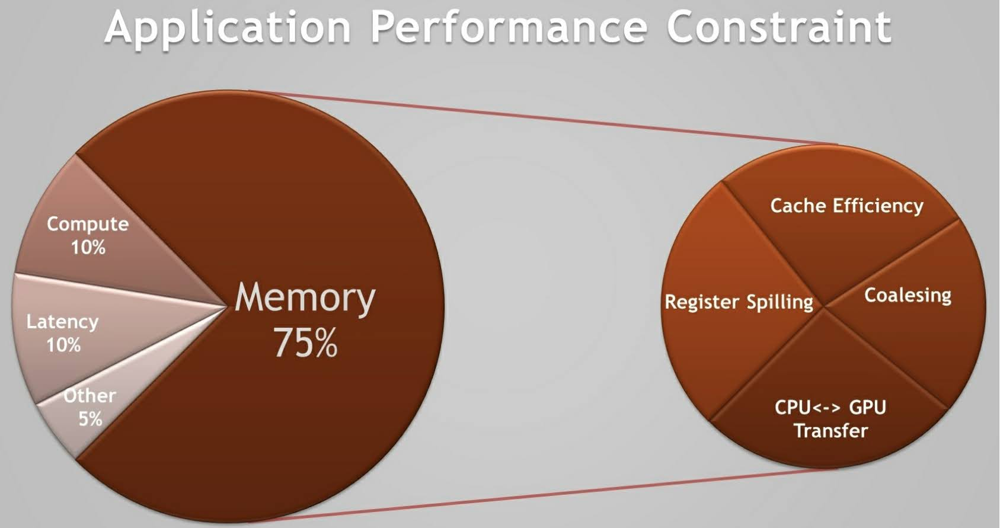
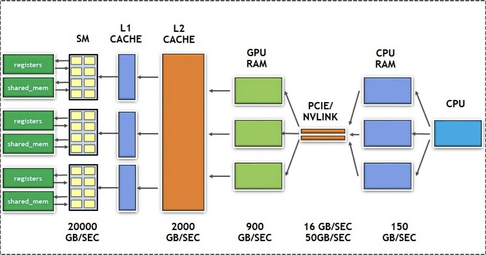
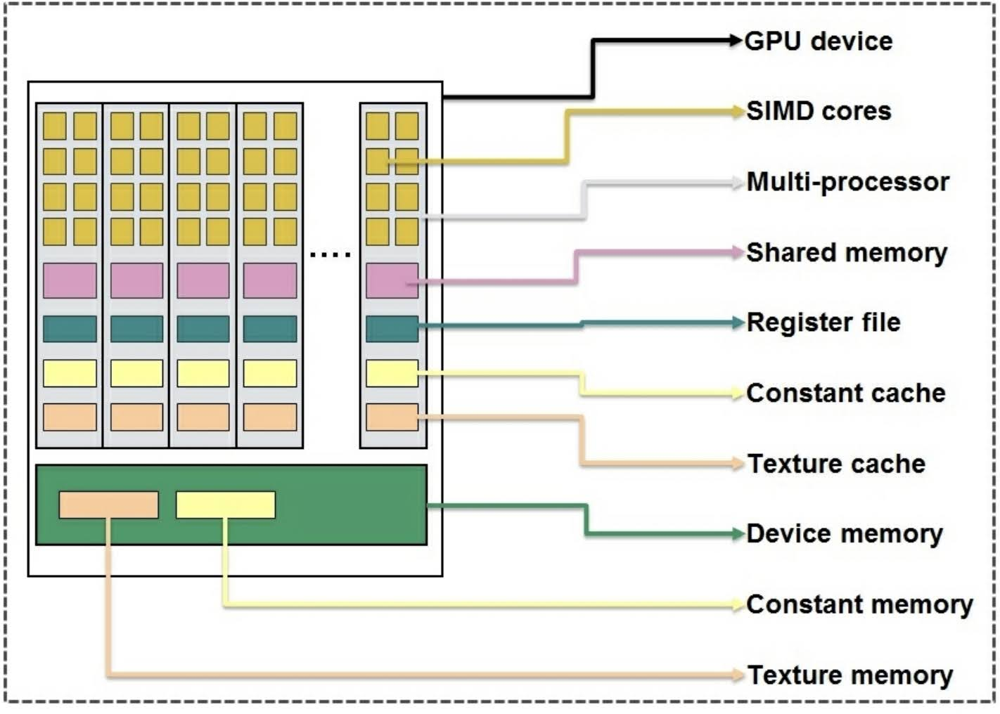

# CUDA Memory Management
第1章で見てきたように，CPU と GPU ではアーキテクチャが根本的に異なり，また，メモリの階層構造も大きく異なる．
両者のメモリの違いは，サイズやタイプだけでなく，目的や設計にまで及んでいる．
ここまで，```blockIdx``` と ```threadIdx``` を使って，
各スレッドがそれぞれのデータにどのようにアクセスするのかを見てきた．
また，デバイス上のメモリを割り当てるのに ```cudaMalloc``` のような API を使ってきた．
GPU では多くのメモリパスが利用可能で，それぞれ異なる特性を持っている．
適切な階層のメモリを最適な方法で使ったときにだけ，CUDA カーネルは最高のパフォーマンスを引き出すことができる．
データを適切なメモリの種類にマッピングすることは開発者の責務である．

経験的に，GPU のアプリケーションでパフォーマンスに関わるものの上位をグラフにプロットすると，次の図のようになる．



上の図のパイチャートは，CUDA ベースのアプリケーションの多くで見られる，パフォーマンス問題に占める割合を表している．
ほとんどの場合，アプリケーションのパフォーマンスはメモリ関連の制約がボトルネックとなる．
アプリケーションとどのメモリパスを使うかに基づいて，メモリ関連の制約は更に細かく分けられる．

それでは，このアプローチを違う視点から見て，正しい種類のメモリを効果的に使うことの重要性を理解しよう．
最新の Volta アーキテクチャ世代の NVIDIA GPU は最大 7000 GFLOPS の計算能力を持ち，メモリの帯域幅は 900GB/s である．
初めに，FROP とメモリ帯域幅の比を見てみると，おおよそ7対1である．
ここで，全てのスレッドが1つの命令を実行するのに4バイトのデータ (float) にアクセスすることを考える．
一気に処理を行う，つまり性能の最大値を引き出すためには，合計で $4 \times 7000 = 28000$ GB/s の帯域幅が必要となる．
900GB/s では225GFLOPの実行能力しか得られない．
これではデバイスの浮動小数点計算の最大性能のたった3.2％しか出せていない．
お気づきのように，GPU は多くのスレッドを実行可能にすることで，レイテンシを隠蔽するアーキテクチャであり，
理論上，メモリアクセスのレイテンシが増大することに耐性がある．
それでも，メモリに対する余分な呼び出しでは，ほんの少しのスレッドの遅延や待機を防ぐことしかできず，
SM のうちいくつかがアイドル状態になってしまう．
CUDA アーキテクチャでは，メモリボトルネックの問題を解決するために我々が利用可能なメモリへのアクセス手法が
いくつか提供されている．

次の図は，CPU のメモリから SM での処理に使われるまでのデータの移動経路を示している．
ここから，計算を行う SM コアに至るまでのデータ要素の行程がわかる．
それぞれのメモリ帯域幅はオーダー単位で大きく異なり，アクセスに必要なレイテンシも全く違う．



次の図は，最新の GPU アーキテクチャの持つ，様々な種類のメモリの階層構造を表している．
それぞれのメモリは，アプリケーション開発者にとって，異なるサイズ，レイテンシ，スループット，そして可視性を持つ．



この章では，様々な種類の GPU メモリをどう最適に活用するかを学ぶ．
また，もっと簡単に開発ができるようになる，最近の GPU ライクなメモリの特徴についても見ていく．
この章では，次のようなメモリに関するトピックを扱う

- Section 2 : [Global memory / device memory](./02_Global_memory_device_memory.md)
- Section 3 : [Shared memory](./03_Shared_memory.md)
- Section 4 : [Read-only data / cache](./04_Read-only_data_cache.md)
- Section 6 : [Pinned memory](./06_Pinned_memory.md)
- Section 7 : [Unified memory](./07_Unified_memory.md)

しかし，メモリの階層構造をみる前に，次のサイクルに従って最適化を行う．

- Step 1 : Analyze
- Step 2 : Parallelize
- Step 3 : Optomize

Step 1 では，アプリケーションの特性を理解しているだけでなく，GPU 上でどう効率的に処理を行うかを知る必要がある．
そのため，GPU メモリに行く前に，最初に Visual Plofiler を紹介する．
この章の内容は，最新の CUDA の特徴を使うため，技術要件をしっかりと満たす環境で行うことが望ましい．


## 技術要件
この章で扱う内容は，次の条件を満たすことを前提とする．

- OS : Linux
- GPU : Pascal アーキテクチャ以降の NVIDIA GPU
- CUDA : CUDA 10.0 以降

GPU のアーキテクチャが不明な場合は，[NVIDIA のサイト](https://developer.nvidia.com/cuda-gpus)から確認できる．

この章のサンプルコードは CUDA 10.1 で開発・検証を行っている．