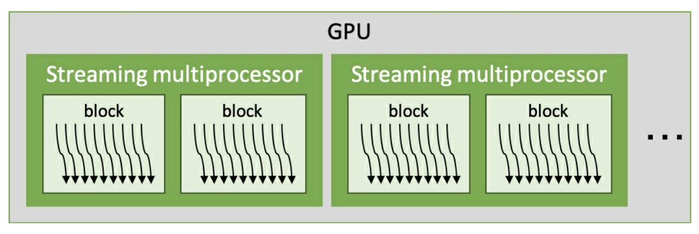

# 3.1 CUDA threads, blocks, and the GPU
CUDA プログラミングにおける基本的な動作単位は CUDA スレッドである．
基本的な CUDA スレッドの実行モデルは，**Single Instruction Multiple Threads (SIMT)** と呼ばれる．
つまり，カーネル関数の本体は単一の CUDA スレッドについての記述している．
しかし，CUDA アーキテクチャは同じ動作をする複数の CUDA スレッドを実行する．

概念的には，複数の CUDA スレッドがグループ内で並列的に動作する．
CUDA スレッドブロックは，複数の CUDA スレッドの集合である．
複数のスレッドブロックが互いに並行的に処理を行う．
スレッドブロックの集合をグリッドと呼ぶ．
これらの関係をまとめると次のようになる．


このような階層的な CUDA のスレッド操作は，CUDA の階層的なアーキテクチャによくマッチする．
CUDA カーネルを立ち上げると，1つ以上の CUDA スレッドブロックが，GPU 上のストリーミングマルチプロセッサ (SM) で，
それぞれ実行される．
また，SM は使用可能な計算資源によって複数のスレッドブロックを実行する．
ブレッドブロック内のスレッド数も，グリッド内のブロック数もまちまちである．



SM は任意にかつ並行的に GPU 資源の許す限り多くのスレッドブロックを実行する．
したがって，並列的に実行可能なスレッドブロックの数は，ブロックの実行にどれ程の GPU 資源が必要であるかということと，
GPU で利用可能な計算資源がどれだけあるかによって様々である．
これについては，あとの節で詳しく述べる．
SM 数は GPU の特性によって異なる．
例えば，Tesla V100 は80機であり，RTX2080(Ti) では48機である．

CUDA の SM は32個の CUDA スレッドをまとめて制御する．
このまとまりを**ワープ (warp)** と呼ぶ．
同様に，1つ以上のワープが CUDA スレッドブロックを構成している．
こうした関係をまとめると，次の図のようになる．


緑の小さな箱は CUDA スレッドであり，ワープにまとめられている．
ワープは GPU アーキテクチャの基本的な制御単位である．
したがって，ワープのサイズは陰に陽に CUDA プログラミングに影響を与える．
例えば，最適なスレッドブロックのサイズは，ブロックのワープスケジューリングと操作を完全に使い切ることのできる，
ワープサイズの倍数の中から決定される．
これを**占有率 (occupancy)** と呼ぶ．
これについては次節で詳しく述べる．
また，ワープ内の CUDA スレッドは並列的に動作し，もとより同期的に処理を行う．
これについては第7節で扱う．


## 3.1.1 Exploring a CUDA block and warp
ここでは，CUDA スレッドのスケジューリングと，その暗黙の同期を CUDA の ```printf```  を使って見ていく．
並列 CUDA スレッドの実行とブロック操作は並行的である．
一方で，デバイスからのスツ力の表示は逐次的なタスクである．
そのため，実行順序を簡単に確認できる．
これは，出力が並行的なタスクに対しては任意であり，並列的なタスクに対しては不変となるためである．

それでは，グローバルなスレッドのインデックス，スレッドブロックのインデックス，ワープのインデックス，
そしてレーンのインデックスを表示するカーネルを書いてみよう．
このコードは次のように書ける．

```c
__global__ void index_print_kernel()
{
    int idx = blockIdx.x * blockDim.x + threadIdx.x;
    int warp_idx = threadIdx.x / warpSize;
    int lane_idx = threadIdx.x & (warpSize - 1);

    if ((lane_idx & (warpSize / 2 - 1)) == 0) {
        // thread, block, warp, lane
        printf(" %5d\t%5d\t %2d\t%2d\n", idx, blockIdx.x, warp_idx, lane_idx);
    }
}
```

このコードによって，ワープの平行性と CUDA スレッドのスケジューリングを理解することができる．
簡単に様々なグリッド，スレッドブロックの設定で試せるように，引数を指定できるようにしておこう．

カーネル関数を呼び出すホストコードは次のようになる．

```c
int main(int argc, char* argv[])
{
    if (argc == 1) {
        puts("Please put Block Size and Thread Block Size..");
        puts("./cuda_thread_block [grid size] [block size]");
        puts("e.g.) ./cuda_thread_block 4 128");

        exit(1);
    }

    int gridSize = atoi(argv[1]);
    int blockSize = atoi(argv[2]);

    puts("thread, block, warp, lane");
    index_print_kernel<<<gridSize, blockSize>>>();
    cudaDeviceSynchronize();

    return 0;
}
```

最後に次のようにコンパイルして結果を見てみよう．
結果の出力はおそらく異なるだろう．

```bash
$ nvcc -m64 -o cuda_thread_block cuda_thread_block.cu
$ ./cuda_thread_block 4 128
thread, block, warp, lane
   320	    2	  2	 0
   336	    2	  2	16
   256	    2	  0	 0
   272	    2	  0	16
   288	    2	  1	 0
   304	    2	  1	16
   352	    2	  3	 0
   368	    2	  3	16
   192	    1	  2	 0
   208	    1	  2	16
   128	    1	  0	 0
   144	    1	  0	16
   224	    1	  3	 0
   240	    1	  3	16
   160	    1	  1	 0
   176	    1	  1	16
     0	    0	  0	 0
    16	    0	  0	16
    64	    0	  2	 0
    80	    0	  2	16
    32	    0	  1	 0
    48	    0	  1	16
    96	    0	  3	 0
   112	    0	  3	16
   384	    3	  0	 0
   400	    3	  0	16
   416	    3	  1	 0
   432	    3	  1	16
   448	    3	  2	 0
   464	    3	  2	16
   480	    3	  3	 0
   496	    3	  3	16
```

この結果から，CUDA スレッドはワープサイズで立ち上げられ，順序は決まっていないことがわかる．
一方，レーンの出力は順序だっている．
この結果から，次のようなことを確認できる

- Out-of-order block execution (ブロックのアウトオブオーダ実行)  
  2列目はスレッドブロックのインデックスを表している．
  結果から，ブロックインデックスと同じ順番で実行されていないことがわかる．
- Out-of-order warp index with a thread block (スレッドブロック内でワープはアウトオブオーダ)  
  3列目はブロック内のワープのインデックスを表している．
  ブロックによってワープの順序が異なる．
  そのため，ワープの実行順序は保証されない．
- Grouped threads executed in a warp (ワープ内でまとまったスレッドが実行される)  
  4列目はワープ内のレーンを表す．
  出力数を減らすため，アプリケーションの出力を2つのインデックスに絞っている．
  各ワープの出力が順番に並んでいることから，```printf``` 関数の出力順は固定されており，
  逆転することはないと推測できる．

まとめると，CUDA スレッドは32スレッドずつグルーピングされ，その出力とワープの実行の順序はバラバラである．
したがって，CUDA カーネルの開発ではこのことに気をつけておく必要がある．