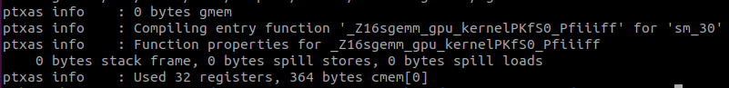
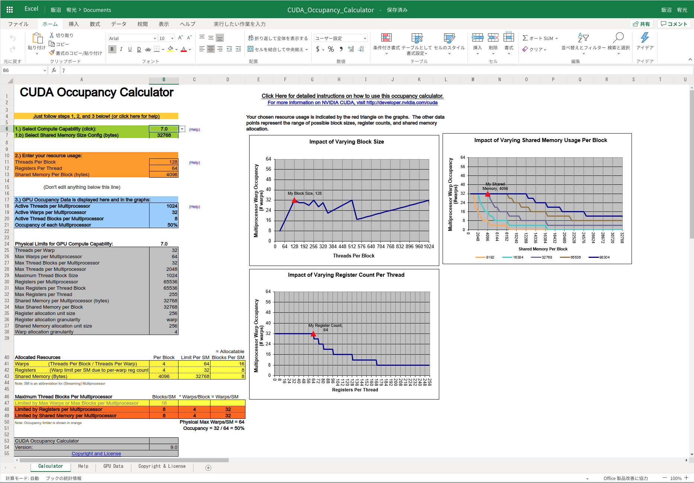
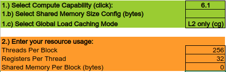
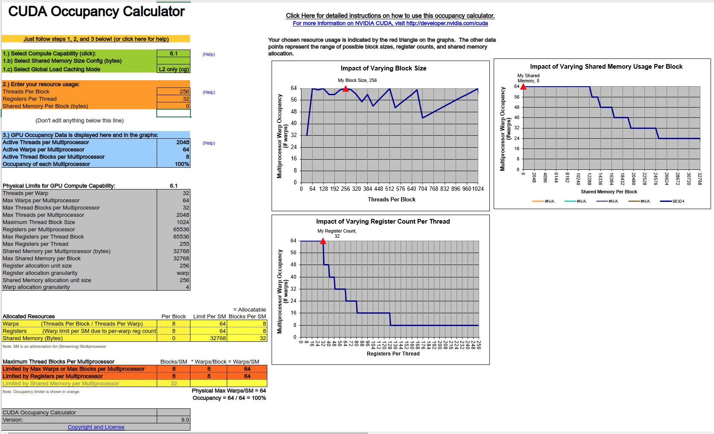
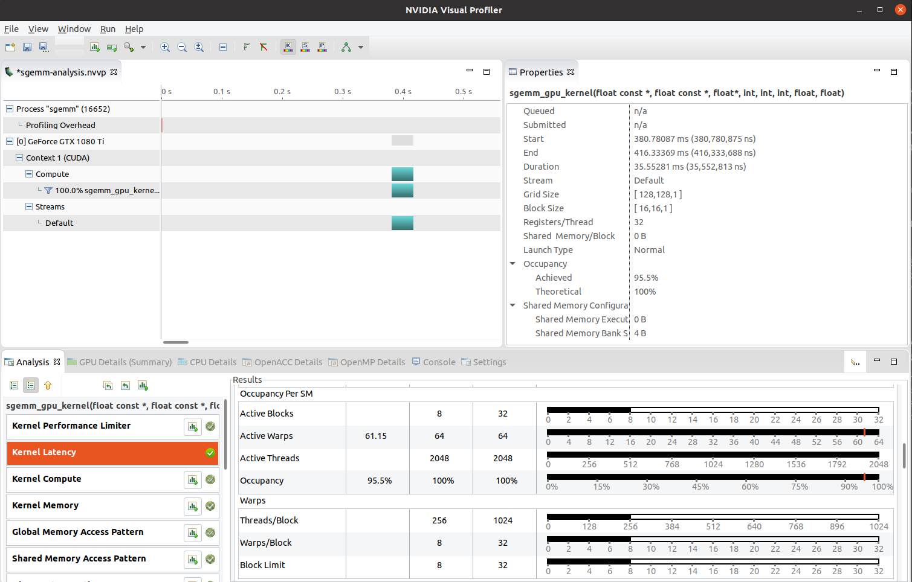

# 2.2 Understanding CUDA occupancy
CUDA の占有率 (Occupancy) は，各 SM が並行処理可能なワープの最大数のうち，アクティブな CUDA ワープの割合を表す．
一般的に，動作していないワープの遅延を隠蔽するのに，より多くのワープが利用可能となるため，
占有率を高めることで GPU を効率良く活用することができる．
しかし，CUDA スレッド間の計算資源の奪い合いが増えるため，パフォーマンスが落ちることもあり得る．
したがって，このトレードオフを理解しておくことが重要ある．

最適な CUDA の占有率を探索することで，GPU の計算資源を使って GPU アプリケーションがワープ命令を効率的に
発行できるようになる．
GPU は SM 上の複数のワープスケジューラを用いて，いくつものワープのスケジューリングをしている．
複数のワープが効率的にスケジューリングできれば，GPU のスレッド間やメモリレイテンシによる遅延を隠蔽することができる．
すると，CUDA コアは継続的に複数のワープから発行された命令を実行できるようになる．
一方で，スケジューリングされなかったワープは次の命令が発行できるようになるまで待機する必要がある．

CUDA の占有率は2つの方法で決定することができる．

- Teoritical occupancy  
  CUDA Occupancy Calculator によって決定される．
  CUDA Toolkit と Excel シートで提供されている．
  カーネルの計算資源の使用状況と，GPU の SM から理論的に各カーネルの占有率を計算できる．

- Achieved occupancy  
  GPU によって決定される．
  SM 上で実際に実行されたワープ数と，使用可能なワープの最大数を反映している．
  この占有率はメトリック解析を使った NVIDIA プロファイラによって計測される．

Theoritical occupancy は，命令間の依存関係やメモリ帯域の制限を考慮していないため，占有率の上限であると言える．

それでは，この占有率と CUDA C/C++ の関係について見ていこう．


## 3.2.1 Setting NVCC to report GPU resource usage
はじめに，次のような **Simple Matrix Multiplication (SGEMM)** カーネルを使う．

```c
__global__ void sgemm_gpu_kernel(const float *A, const float *B, float *C, int N, int M, int K, float alpha, float beta)
{
    int col = blockIdx.x * blockDim.x + threadIdx.x;
    int row = blockIdx.y * blockDim.y + threadIdx.y;

    float sum = 0.f;
    for (int i = 0; i < K; ++i) {
        sum += A[row * K + i] * B[i * K + col];
    }

    C[row * M + col] = alpha * sum + beta * C[row * M + col];  
}
```

このカーネル関数を，次のようなカーネルを使って呼び出す．

```c
void sgemm_gpu(const float *A, const float *B, float *C, int N, int M, int K, float alpha, float beta)
{
    dim3 dimBlock(BLOCK_DIM_X, BLOCK_DIM_Y);
    dim3 dimGrid(M / dimBlock.x, N / dimBlock.y);
    sgemm_gpu_kernel<<<dimGrid, dimBlock>>>(A, B, C, N, M, K, alpha, beta);
}
```

ここでは $N$，$M$，$K$ を2048，ブロックの各次元を16としている．

それでは，コンパイラにカーネル関数の GPU 資源の使用状況をレポートさせる方法を見ていこう．


## 3.2.2 The settings for Linux
Linux の環境では，コンパイルする際に2つのオプションを指定する．

- ```--resource-usage (--res-usage)```  
  GPU リソースの使用状況についての設定．
- ```-gencode```  
  使用している GPU アーキテクチャを指定し，オペコードを生成する．
  - Turing : ```compute_75, sm_75```
  - Volta : ```compute_70, sm_70```
  - Turing : ```compute_60, sm_60, compute_61, sm_61```

ここでは，Pascal 世代の GPU を使用しているので，次のようにコンパイルすれば良い．

```bash
$ nvcc -m 64 --resource-usage \
       -gencode arch=compute_61, code=sm_61 \
       -I /usr/local/cuda/samples/common/inc \
       -o sgemm ./sgemm.cu
```

複数のバージョンを指定することもできる．

```bash
$ nvcc -m 64 --resource-usage \
       -gencode arch=compute_61, code=sm_61 \
       -gencode arch=compute_70, code=sm_70 \
       -I /usr/local/cuda/samples/common/inc \
       -o sgemm ./sgemm.cu
```

それでは，ソースコードをコンパイルしてみよう．
NVCC の出力からリソースの使用状況のレポートが見られる．



NVCC は各 compute capability について，CUDA カーネルのリソース使用状況をレポートする．
ここでは，1スレッドあたりのレジスタ数と定常的なメモリの使用状況が表示されている．


## 3.2.3 The settings for Windows
Windows での開発は想定していないので略．


## 3.2.4 Analyzing the optimal occupancy using the Occupancy Calculator
実際に CUDA Toolkit で提供されている CUDA Occupancy Calculator を使ってみよう．
これを使って，いくつかカーネルの情報を与えてやることで，理論的な占有率が得られる．
計算は Excel ファイル上で行い，```/usr/local/cuda/tools``` に格納されている．



この計算機は2つのパートに分かれている．
1つ目はカーネルの情報を入力するパート，2つ目が占有率の情報を出力するパートである．
入力には2種類の情報が必要となる．

- GPU の compute capability (緑の欄)
- スレッドブロックリソースの情報 (オレンジの欄)
  - CUDA スレッドブロックあたりのスレッド数
  - CUDA スレッドあたりのレジスタ
  - ブロックあたりの共有メモリ

計算結果として次のような占有率の情報を出力する．

- GPU の占有率のデータ (青の欄)
- GPU の compute capability による物理的な制限 (灰色の欄)
- ブロックあたりに割り当てられたリソース (黄色の欄)
- SM あたりの最大スレッドブロック数 (黄色，オレンジ，赤の欄)
- ブロックあたりのスレッド，レジスタ，共有メモリの使用状況に基づく，占有率のリミットグラフ
- 現在の占有率を表すグラフ上の赤色の三角形

今回の実験条件を次のように設定する．



Compute capability や入力内容で結果は変化するが，今回は次のような結果が得られた．



青色のエリアにはカーネル関数の achieved occupancy が表示される．
ここでは，100%の占有率を達成している．
シートの右側には CUDA スレッドと共有メモリ，レジスタの各 GPU リソースの占有状況を表すグラフが表示されている．

一般的に，多くの理由からカーネルコードは100%の理論的占有率を達成できない．
しかし，ピック占有率を設定することは，GPU リソースを効率的に使うためのスタートになる．


## 3.2.5 Occupancy tuning - bounding register usage
CUDA レジスタは，カーネルのアルゴリズムが複雑なときや倍精度データ型を扱う場合によく使われる．
この場合，アクティブなワープ数が限られるために占有率は低くなる．
そのような状況では，レジスタの使用を制限して理論的占有率を上げて，パフォーマンスが上がるかどうかを判定できる．

GPU のリソース使用をチューニングする方法の1つとして，カーネル関数に ```__launch_bound__``` 修飾子を使う方法がある．
これによって，NVCC にブロックサイズを最大化することで，SM あたりのスレッドブロック数を最小化することを保証する．
すると，NVCC は指定された条件下で最適なレジスタサイズを決定してくれる．
この方法は，コンパイル時に効率的にアルゴリズムを実行できるサイズがわかっている場合に使える．
使用する際のコードは次のようになる．

```c
int maxThreadPerBlock = 256;
int minBlocksPerMultiprocessor = 2;

__global__ void __launch_bound__ (maxThreadPerBlock, minBlocksPerMultiprocessor) foo_kernel()
{
  ...
}
```

このようにすると，コンパイラはリソースの上限を確認し，ブロックあたりのリソースの使用を制限する．
リソースの使用が上限を超えない場合には，2つ目のパラメータが与えられていなければ，
マルチプロセッサあたりに追加でスレッドブロックをスケジューリングできないか，コンパイラはレジスタの使用を調整する．
その変わりに，コンパイラは単一スレッド命令による遅延を隠蔽するためにレジスタの使用量を増やす．

また，シンプルにアプリケーションレベルで占有されているレジスタ使用量を制限することもできる．
```--maxrregcount``` フラグで NVCC に対して その数を指定することができ，
コンパイラはレジスタの使用量を再調整してくれる．
Linux のターミナルからは，次のように数字を指定できる．

```bash
$ nvcc -m 64 --resource-usage \
       -gencode arch=compute_61, code=sm_61 \
       -I /usr/local/cuda/samples/common/inc \
       --maxrregcount 24 \
       -o sgemm ./sgemm.cu
```

ただし，この方法でレジスタの使用量を制限すると，レジスタスロットリングによってスレッドのパフォーマンスが
低下してしまうことに留意しなければならない．
コンパイラでも，制限値以下に設定できなければ，レジスタをローカルメモリに分割して，
ローカル変数をグローバルメモリに配置することができる．


## 3.2.6 Getting the achieved occupancy from the profiler
Visual Profiler を使って，プロファイリングされたメトリックデータから achieved occupancy が得られる．
ターゲットのカーネルのタイムラインバーをクリックする．
すると，Properties のパネルに theoritical と achieved 両方の占有率が表示される．
Kernel Latency のメニューからさらに詳しい情報が得られる．
次のような結果が得られる．



この占有率のチューニングでは CUDA ブロックサイズを，SM 内でスケジューリングするワープを使い切るように設計できる．
しかし，これでは前節で見つけたメモリスロットリングの問題を解決できていない．
これは，マルチプロセッサはストールを起こしうることや，メモリリクエストが妨害されることで
メモリアクセスの遅延を打ち消せないことを表している．
この章と第7章でこれを最適化する方法を行列と行列の掛け算を最適化することを通して議論する．