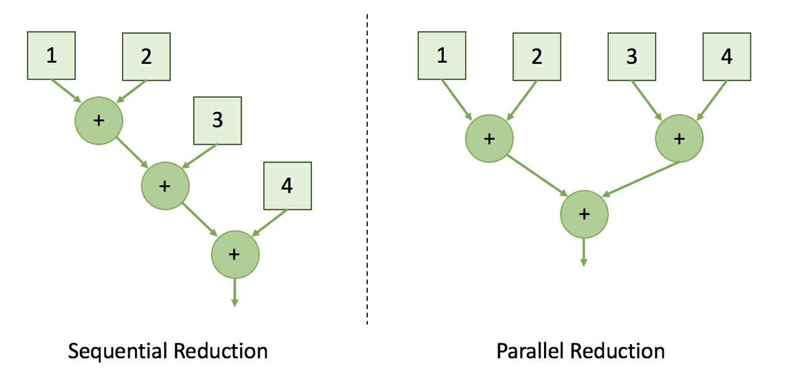

# 3.3 Understanding parallel reduction
リダクションはシンプルだが，多くのパラメータの中から共通のパラメータを見つけるのに便利なアルゴリズムである．
このタスクは逐次的あるいは並列的に処理できる．
並列アーキテクチャで並列処理を行う場合には，並列リダクションはヒストグラムや平均，
その他の統計的な値を得るのに最も高速な方法である．

次の図は，逐次的なリダクションと並列的なリダクションの違いを表している．

リダクションタスクを並列に処理することで，$log$ スケールで合計のステップ数を削減することができる．
ここでは，この並列的なリダクションアルゴリズムを GPU 上で実装する．
その後，共有メモリを使って同じアルゴリズムを実装し直してみる．
この2つの実装を比較して，パフォーマンスにどのような違いが見られるかを議論する．

## 3.3.1 Naive parallel reduction using global memory
